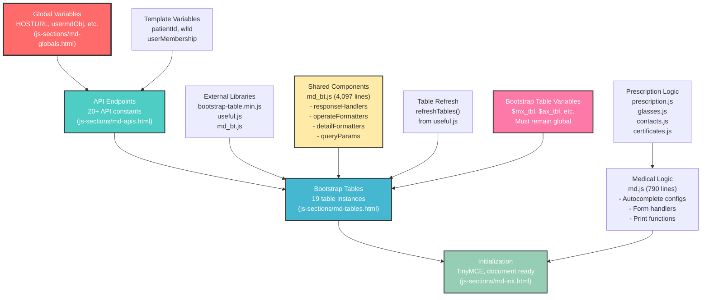

# JavaScript Dependency Mapping - Medical Examination Controller

## Overview

This document provides the critical JavaScript dependency analysis for refactoring `templates/modalityCtr/md.html` into modular components. This analysis is **PHASE 1** of the refactoring project and forms the foundation for safe modularization.

## Executive Summary

### Critical Findings

- **19 Bootstrap Tables** with complex interdependencies
- **4-level JavaScript dependency chain** that must be preserved
- **Shared component architecture** across all tables
- **API endpoint dependencies** on global variables
- **Table refresh mechanism** used throughout the application

### Risk Level: **CRITICAL**

Any disruption to the dependency chain will break all table functionality and medical examination workflows.

## JavaScript Load Order Analysis

### Current Load Sequence

```javascript
// 1. External Libraries (Bootstrap, jQuery, etc.)
<script src="js/bootstrap-table_1.22/bootstrap-table.min.js"></script>
<script src="js/bootbox/bootbox.all.min.js"></script>
<script src="js/jquery/jquery.serialize-object.min.js"></script>
<script src="js/utils/bootstrap-autocomplete.min.js"></script>
<script src="js/timer.jquery.min.js"></script>

// 2. Core Utility Libraries
<script src="js/utils/useful.js"></script>              // Global utilities, refreshTables()
<script src="js/templates/patient-bar.js"></script>         // Patient bar functionality

// 3. Bootstrap Table Configuration
<script src="js/md/md_bt.js"></script>               // Table configs, formatters, handlers

// 4. PDF and Rich Text Libraries
<script src="js/pdfmake/pdfmake.min.js"></script>
<script src="js/pdfmake/vfs_fonts.js"></script>
<script src="js/jsbarcode/JsBarcode.itf.min.js"></script>
<script src="js/utils/html-to-pdfmake.js"></script>
<script src="js/tinymce/tinymce.min.js"></script>

// 5. Inline JavaScript Sections (in md.html)
// 5a. Global Variables
// 5b. API Endpoints  
// 5c. Bootstrap Table Instances
// 5d. TinyMCE Initialization
// 5e. Document Ready Handlers

// 6. Medical Examination Logic
<script src="js/md/md.js"></script>                  // Core medical logic
<script src="js/md/prescription.js"></script>        // Prescription handling
<script src="js/md/glasses.js"></script>             // Glasses prescriptions
<script src="js/md/contacts.js"></script>            // Contact lens prescriptions
<script src="js/md/certificates.js"></script>        // Certificate generation
```

## Global Variables Dependencies

### Critical Global Variables (Must Load First)

```javascript
// Base Configuration
const HOSTURL = "[[ = hosturl ]]";               // Used by ALL API endpoints
var usermdObj = [[ =XML(mdParams)]];             // Medical parameters
var userObj = [[ =XML(userDict)]];               // User information
var modalityDict = [[ = XML(modalityDict)]];     // Modality configuration
let modalityController = '[[ = XML(modalityController) ]]';

// Application Variables  
var timer_id = [];                               // Timer management
var rxObj = [], tonoObj = [];                    // Prescription objects
var prescRxObj = {};                             // Prescription cache
var axe64, logo64;                               // Image data for PDFs

// Form Control
const btnArr = ['#btnTaskDone', '#btnNewMx', '#btnNewAx', '#btnNewmHx', 
               '#btnNewsHx', 'input', 'textarea', '#btnNewCoding', 
               '#btnNewMxWl', '#btnMxRx', '#btnGxRx'];
```

## API Endpoints Dependencies

### API Endpoint Pattern

**Dependencies**:

- `HOSTURL` (global variable)
- `APP_NAME` (implied global)
- `patientId`, `wlId` (template variables)

### Complete API Endpoint List

```javascript
// Core APIs
const API_MD = HOSTURL + "/" + APP_NAME + "/api/md?...&id_worklist.eq=" + wlId;
const API_AUTODICT = HOSTURL + "/" + APP_NAME + "/api/auto_dict?...&keywd.eq=";

// Reference Data APIs (for autocomplete)
const API_MEDICATIONS = HOSTURL + "/" + APP_NAME + "/api/medic_ref?...";
const API_AGENTS = HOSTURL + "/" + APP_NAME + "/api/agent?...";  
const API_DISEASES = HOSTURL + "/" + APP_NAME + "/api/disease_ref?...";
const API_LENSES = HOSTURL + "/" + APP_NAME + "/api/cl?...";
const API_CLEANING = HOSTURL + "/" + APP_NAME + "/api/cleaning_solution?...";

// Patient History APIs
const API_MXUSER = HOSTURL + "/" + APP_NAME + "/api/mx?...&id_auth_user.eq=" + patientId;
const API_AXUSER = HOSTURL + "/" + APP_NAME + "/api/allergy?...&id_auth_user.eq=" + patientId;
const API_MHXUSER = HOSTURL + "/" + APP_NAME + "/api/phistory?category.eq=medical&...&id_auth_user.eq=" + patientId;
const API_SHXUSER = HOSTURL + "/" + APP_NAME + "/api/phistory?category.eq=surgical&...&id_auth_user.eq=" + patientId;
const API_OHXUSER = HOSTURL + "/" + APP_NAME + "/api/phistory?site.in=right,left,both&...&id_auth_user.eq=" + patientId;

// Examination Data APIs
const API_RXRIGHT = HOSTURL + "/" + APP_NAME + "/api/rx?id_auth_user.eq=" + patientId + "&laterality.eq=right&...";
const API_RXLEFT = HOSTURL + "/" + APP_NAME + "/api/rx?id_auth_user.eq=" + patientId + "&laterality.eq=left&...";
const API_TONORIGHT = HOSTURL + "/" + APP_NAME + "/api/tono?laterality.eq=right&...&id_auth_user=" + patientId;
const API_TONOLEFT = HOSTURL + "/" + APP_NAME + "/api/tono?laterality.eq=left&...&id_auth_user=" + patientId;
const API_KMRIGHT = HOSTURL + "/" + APP_NAME + "/api/km?id_auth_user.eq=" + patientId + "&laterality.eq=right&...";
const API_KMLEFT = HOSTURL + "/" + APP_NAME + "/api/km?id_auth_user.eq=" + patientId + "&laterality.eq=left&...";

// Worklist APIs
const API_PROCEDURE_LIST = HOSTURL + '[[=URL('api','worklist')]]' + '?...&id_auth_user.id.eq=' + patientId + '&...';
const API_CODING = HOSTURL + "/" + APP_NAME + "/api/phistory?id_worklist.eq=" + wlId + "&...&id_auth_user.eq=" + patientId;
const API_MXWLUSER = HOSTURL + "/" + APP_NAME + "/api/mx?id_worklist.eq=" + wlId + "&...&id_auth_user.eq=" + patientId;

// Prescription APIs
const API_GXRX = HOSTURL + "/" + APP_NAME + "/api/glasses_rx_list?id_auth_user.eq=" + patientId + "&...";
const API_MXRX = HOSTURL + "/" + APP_NAME + "/api/medical_rx_list?id_worklist.eq=" + wlId + "&...";
const API_CXRX = HOSTURL + "/" + APP_NAME + "/api/contacts_rx_list?id_auth_user.eq=" + patientId + "&...";
const API_CERT = HOSTURL + "/" + APP_NAME + "/api/certificates?id_auth_user.eq=" + patientId + "&...";

// Billing API
const API_BILLING = HOSTURL + "/" + APP_NAME + "/api/billing_codes/by_worklist/" + wlId;
```

## Bootstrap Table Dependencies Matrix

### 19 Bootstrap Table Instances

| Table Variable   | Table ID         | API Endpoint         | Purpose               |
| ---------------- | ---------------- | -------------------- | --------------------- |
| `$mx_tbl`        | `#mx_tbl`        | `API_MXUSER`         | Medications           |
| `$ax_tbl`        | `#ax_tbl`        | `API_AXUSER`         | Allergies             |
| `$mHx_tbl`       | `#mHx_tbl`       | `API_MHXUSER`        | Medical History       |
| `$sHx_tbl`       | `#sHx_tbl`       | `API_SHXUSER`        | Surgical History      |
| `$oHx_tbl`       | `#oHx_tbl`       | `API_OHXUSER`        | Ocular History        |
| `$table_wl`      | `#table-wl`      | `API_PROCEDURE_LIST` | Worklist              |
| `$rxRight`       | `#rxRight_tbl`   | `API_RXRIGHT`        | Right Eye Refraction  |
| `$rxLeft`        | `#rxLeft_tbl`    | `API_RXLEFT`         | Left Eye Refraction   |
| `$coding`        | `#coding_tbl`    | `API_CODING`         | ICD Coding            |
| `$mxWl_tbl`      | `#mxWl_tbl`      | `API_MXWLUSER`       | Worklist Medications  |
| `$tonoRight_tbl` | `#tonoRight_tbl` | `API_TONORIGHT`      | Right Eye Tonometry   |
| `$tonoLeft_tbl`  | `#tonoLeft_tbl`  | `API_TONOLEFT`       | Left Eye Tonometry    |
| `$gxrx_tbl`      | `#GxRx_tbl`      | `API_GXRX`           | Glasses Prescriptions |
| `$mxrx_tbl`      | `#mxrx_tbl`      | `API_MXRX`           | Medical Prescriptions |
| `$cxrx_tbl`      | `#cxrx_tbl`      | `API_CXRX`           | Contact Prescriptions |
| `$cert_tbl`      | `#cert_tbl`      | `API_CERT`           | Certificates          |
| `$kmRight`       | `#kmRight_tbl`   | `API_KMRIGHT`        | Right Eye Keratometry |
| `$kmLeft`        | `#kmLeft_tbl`    | `API_KMLEFT`         | Left Eye Keratometry  |
| `$bill_tbl`      | `#bill_tbl`      | `API_BILLING`        | Billing Codes         |

### Shared Bootstrap Table Components

#### From `md_bt.js` (4,097 lines)

**Response Handlers:**

- `responseHandler_mx()` - Medications table data processing
- `responseHandler_ax()` - Allergies table data processing
- `responseHandler_msHx()` - Medical/surgical history processing
- `responseHandler_wl()` - Worklist data processing
- `responseHandler_rx()` - Refraction data processing
- `responseHandler_km()` - Keratometry data processing
- `responseHandler_tono()` - Tonometry data processing
- `responseHandler_gx()` - Glasses prescription processing
- `responseHandler_mxrx()` - Medical prescription processing
- `responseHandler_cxrx()` - Contact prescription processing
- `responseHandler_cert()` - Certificate processing
- `responseHandler_billing()` - Billing data processing

**Query Parameters:**

- `queryParams()` - Universal query parameter handler for pagination, sorting
- `queryParams_wl()` - Worklist-specific query parameters
- `queryParams_tono()` - Tonometry-specific query parameters

**Operation Formatters:**

- `operateFormatter_mx()` - Edit/delete buttons for medications
- `operateFormatter_ax()` - Edit/delete buttons for allergies
- `operateFormatter_msHx()` - Edit/delete buttons for medical history
- `operateFormatter_wl()` - Action buttons for worklist
- `operateFormatter_rx()` - Action buttons for refraction
- `operateFormatter_km()` - Action buttons for keratometry
- `operateFormatter_tono()` - Action buttons for tonometry
- `operateFormatter_gx()` - Action buttons for glasses prescriptions
- `operateFormatter_mxrx()` - Action buttons for medical prescriptions
- `operateFormatter_cxrx()` - Action buttons for contact prescriptions
- `operateFormatter_cert()` - Action buttons for certificates
- `operateFormatter_billing()` - Action buttons for billing

**Event Handlers:**

- `operateEvents_mx` - Modal operations for medications
- (Similar event handler patterns for all table types)

**Detail Formatters:**

- `detailFormatter_mx()` - Expandable row details for medications
- `detailFormatter_ax()` - Expandable row details for allergies
- (Detail formatters for all 19 table types)

**Utility Functions:**

- `checkIfNull()` - Null value handling
- `highlightValue()` - Conditional cell highlighting
- Various cell styling functions for each table type

### Table Refresh Mechanism

#### From `useful.js`

```javascript
function refreshTables(tablesArr) {
    for (let tbl of tablesArr) {
        if (typeof $(tbl).bootstrapTable === "function") {
            $(tbl).bootstrapTable("refresh");
        } else {
            console.error("bootstrapTable function not defined for", tbl);
        }
    }
}
```

#### Table Arrays Definition

```javascript
// All table IDs for bulk operations
const tablesArr = ['#mx_tbl', '#ax_tbl', '#mHx_tbl', '#sHx_tbl', '#oHx_tbl', '#table-wl',
    '#rxRight_tbl', '#rxLeft_tbl', '#coding_tbl', '#mxWl_tbl',
    '#kmRight_tbl', '#kmLeft_tbl',
    '#tonoRight_tbl', '#tonoLeft_tbl', '#GxRx_tbl', '#mxrx_tbl', '#cxrx_tbl', '#cert_tbl', '#bill_tbl'];
```

#### Navigation-Based Refresh Logic

```javascript
$(document).ready(function () {
    // Conditional table refresh based on referrer
    if (document.referrer.includes('modalityCtr/autorx')) {
        refreshTables(['#rxRight_tbl', '#rxLeft_tbl']);
    };
    if (document.referrer.includes('modalityCtr/tono')) {
        refreshTables(['#tonoRight_tbl', '#tonoLeft_tbl']);
    };
});

// Back navigation refresh
if (window.performance.getEntriesByType('navigation')[0].type == 'back_forward' || 
    window.performance.getEntriesByType('navigation')[0].type == 'prerender') {
    refreshTables(tablesArr);  // Refresh ALL tables
};
```

## Medical Examination Logic Dependencies

### From `md.js` (790 lines)

**DOM Manipulations:**

```javascript
// Remove fixed navigation for medical examination context
document.getElementById('topNavbar').classList.remove('fixed-top');
```

**Autocomplete Configurations:**

- Frequency autocomplete (using `API_AUTODICT`)
- Medication autocomplete (using `API_MEDICATIONS`)
- Agent autocomplete (using `API_AGENTS`)
- Disease autocomplete (using `API_DISEASES`)
- Lens autocomplete (using `API_LENSES`)
- Cleaning solution autocomplete (using `API_CLEANING`)

**Core Functions:**

- `delItem()` - Delete operations across all tables
- `setCounter()` - UI counter management
- `setWlItemStatus()` - Worklist item status updates
- `set_timers()` - Timer management for procedures
- `updateCache()` - Cache management for prescriptions
- `getWlItemData()` - Fetch worklist data
- Various form submission handlers
- Print functions for prescriptions

## TinyMCE Dependencies

### Rich Text Editor Initialization

**Dependencies:**

- `tinymce.min.js` library loaded
- DOM elements `#certificateContent` and `#emailContent` must exist

```javascript
tinymce.init({
    selector: '#certificateContent',
    height: '500px',
    plugins: 'save code link table',
    license_key: 'gpl'
});

tinymce.init({
    selector: '#emailContent', 
    height: '500px',
    plugins: 'save code link table',
    license_key: 'gpl'
});
```

## Modularization Strategy

### Proposed JavaScript Section Structure

```
js-sections/
├── md-globals.html           (~50 lines)
│   ├── Global variables
│   ├── Configuration objects
│   └── Button arrays
├── md-apis.html              (~150 lines)
│   ├── All API endpoint definitions
│   └── URL construction logic
├── md-tables.html            (~250 lines)
│   ├── All 19 bootstrap table instances
│   ├── Table array definitions
│   └── Table-specific configurations
└── md-init.html              (~150 lines)
    ├── TinyMCE initialization
    ├── Document ready handlers
    ├── Navigation refresh logic
    └── Table refresh triggers
```

### Critical Load Order Requirements

1. **md-globals.html** - MUST load first (all other sections depend on these variables)
2. **md-apis.html** - Depends on global variables (HOSTURL, APP_NAME, patientId, wlId)
3. **md-tables.html** - Depends on API endpoints and md_bt.js configurations
4. **md-init.html** - Depends on all previous sections and external libraries

### Dependency Validation Checklist

- [ ] Global variables accessible across all sections
- [ ] API endpoints properly constructed with required variables
- [ ] Bootstrap table variables remain globally accessible
- [ ] Table refresh mechanism preserved
- [ ] Autocomplete configurations maintain API connections
- [ ] TinyMCE initialization occurs after DOM elements exist
- [ ] Event handlers properly bound to dynamically created elements

## Risk Mitigation

### HIGH RISK Areas

1. **Bootstrap Table Variable Scope**
   - **Risk**: Table variables (`$mx_tbl`, etc.) must remain globally accessible
   - **Mitigation**: Ensure all table variables are declared in global scope

2. **API Endpoint Timing**
   - **Risk**: API constants used before definition
   - **Mitigation**: Strict load order enforcement

3. **Shared Function Dependencies**
   - **Risk**: `refreshTables()`, `queryParams()`, formatters not available when needed
   - **Mitigation**: Load useful.js and md_bt.js before table initialization

### MEDIUM RISK Areas

1. **Event Handler Binding**
   - **Risk**: Handlers bound before DOM elements exist
   - **Mitigation**: Use document ready handlers and delegation

2. **Form Dependencies**
   - **Risk**: Form IDs and autocomplete configurations
   - **Mitigation**: Preserve form structure and ID naming

### Testing Strategy

1. **Unit Testing**: Test each JavaScript section independently
2. **Integration Testing**: Verify table refresh across all sections
3. **Load Order Testing**: Test various load sequences
4. **Performance Testing**: Measure initialization time before/after

## JavaScript Dependency Diagram



## Conclusion

This dependency mapping reveals a complex but well-structured JavaScript architecture. The modularization must preserve:

- **Exact load order** of the 4-level dependency chain
- **Global accessibility** of all bootstrap table variables
- **Shared component architecture** across 19 tables
- **Navigation-based refresh logic** for user experience
- **API endpoint construction** using template variables

The modular approach will enable better maintainability while preserving all critical functionality.

---

**Status**: Phase 1 Complete - Ready for Phase 2 (CSS and Styles Extraction)  
**Next Action**: Begin CSS extraction and JavaScript section modularization  
**Risk Level**: Well-documented and manageable with strict adherence to load order
