# Database Models Documentation

This document describes the database models used in the Oph4Py application.

## Overview

Oph4Py uses a relational database to store various types of medical data including:

- Patient information
- Medical examinations
- Prescriptions
- Medical history
- Clinical measurements
- Administrative data

## Database Schema

```mermaid
erDiagram
    auth_user ||--o{ photo_id : has
    auth_user ||--o{ address : has
    auth_user ||--o{ phone : has
    auth_user ||--o{ insurance : has
    auth_user ||--o{ worklist : has
    auth_user ||--o{ rx : has
    auth_user ||--o{ phistory : has
    auth_user ||--o{ mx : has
    auth_user ||--o{ allergy : has
    auth_user ||--o{ md_params : has
    auth_user ||--o{ auth_user : "modifies"
    auth_user }|--|| membership : "belongs to"
    auth_user }|--|| gender : "has"
    auth_user }|--|| marital : "has"
    auth_user }|--|| ethny : "has"

    facility ||--o{ worklist : "sends to"
    modality_controller ||--o{ modality : controls
    modality_family ||--o{ procedure_family : has
    modality ||--o{ procedure_family : uses
    modality ||--o{ combo : has
    modality ||--o{ biometry : measures
    procedure ||--o{ procedure_family : belongs
    procedure ||--o{ combo : has
    procedure ||--o{ worklist : requested

    data_origin ||--o{ address : "defines origin"
    data_origin ||--o{ phone : "defines origin"
    insurance_sector ||--o{ insurance : "defines type"

    worklist ||--o{ tono : generates
    worklist ||--o{ km : generates
    worklist ||--o{ capsulotomy : generates
    worklist ||--o{ rx : generates
    worklist ||--o{ ant_biom : generates
    worklist ||--o{ post_biom : generates
    worklist ||--o{ motility : generates
    worklist ||--o{ phoria : generates
    worklist ||--o{ pupils : generates
    worklist ||--o{ current_hx : generates
    worklist ||--o{ followup : generates
    worklist ||--o{ billing : generates
    worklist ||--o{ soap : generates
    worklist ||--o{ medical_rx_list : generates
    worklist ||--o{ glasses_rx_list : generates
    worklist ||--o{ contacts_rx_list : generates
    worklist ||--o{ certificates : generates
    worklist ||--o{ biometry : generates
    worklist ||--o{ inspection : generates
    worklist ||--o{ auscultation : generates
    worklist ||--o{ palpation : generates
    worklist ||--o{ percussion : generates
    worklist ||--o{ neuro : generates
    worklist ||--o{ vitals : generates

    disease_ref ||--o{ phistory : references
    medic_ref ||--o{ mx : prescribes
    agent ||--o{ allergy : causes
    optotype ||--o{ rx : measures
    status_rx ||--o{ rx : has

    cl ||--o{ contacts_rx_list : uses
    cleaning_solution ||--o{ contacts_rx_list : recommends
```

## Tables Description

### Administrative Tables

#### User Management and Access Control

- **auth_user**: Core user profile table containing all user information
  - Basic authentication: username, email, password
  - Personal information: first_name, last_name, maiden_name, dob, nationality
  - Birth details: birth_town, birth_country
  - Demographics: gender (ref), marital status (ref), ethnicity (ref)
  - ID information: idc_num, ssn, chipnumber, validfrom, validtill, initials
  - Special fields: uid (unique identifier), noblecondition, documenttype, specialstatus
  - Security: last_password_change, past_passwords_hash, action_token, sso_id
  - Photo: photob64 (stored as blob)
  - Audit fields: created_by, created_on, modified_by, modified_on, is_active

- **membership**: User role and hierarchy management
  - membership: Role name (Admin, Doctor, Nurse, Medical assistant, Administrative, Patient)
  - hierarchy: Numeric value defining access level (0=Admin, 1=Doctor, 2=Nurse/Medical assistant, 3=Administrative, 99=Patient)

#### Reference Tables

- **gender**: Reference table for gender identification
  - sex: Predefined values (Male, Female, Other)
  - Used for patient and staff demographics

- **ethny**: Reference table for ethnic background
  - ethny: Predefined values (Caucasian, Black, Hispanic, Arabic)
  - Used for patient demographics and cultural considerations

- **marital**: Reference table for marital status
  - marital_status: Predefined values (single, married)
  - Used for patient social status tracking

#### Facility Management

- **facilities**: Hospital/clinic facilities registration
  - facility_name: Name of the facility
  - hosp_id: Hospital identifier
  - Includes audit trail (created_by, modified_by, etc.)

- **facility**: Operational facilities within a medical practice
  - facility_name: Specific locations/rooms (e.g., Desk1, Desk2, Iris, Cornea, Retina, Exam1)
  - Used for resource allocation and scheduling
  - Includes audit trail
  - Represents physical or logical examination/consultation spaces

#### Patient Information Management

- **photo_id**: Patient identification photos
  - imagefile: Uploaded photo file
  - b64img: Base64 encoded image data
  - Links to auth_user for patient identification

- **address**: Patient contact addresses
  - Structured address fields (home_num, box_num, address1, address2, zipcode, town, country)
  - address_rank: Priority/order of addresses
  - address_origin: Links to data_origin for classification

- **phone**: Patient contact numbers
  - phone_prefix: International dialing code
  - phone: Contact number
  - phone_origin: Links to data_origin for classification

- **insurance**: Patient insurance information
  - insurance_name: Name of insurance provider
  - insurance_plan: Specific plan details
  - insurance_type: Links to insurance_sector for categorization

#### Contact Classification

- **data_origin**: Source classification for contact information
  - origin: Predefined values (Home, Mobile, Work)
  - Used to categorize contact details (addresses, phone numbers)
  - Helps maintain organized patient contact information

- **insurance_sector**: Insurance categorization
  - sector: Type of insurance coverage
  - Used to classify insurance providers and plans

### Medical Data Tables

- **tono**: Tonometry measurements
- **km**: Keratometry measurements
- **capsulotomy**: Capsulotomy procedure data
- **biometry**: Biometric measurements

### Medical History

- **disease_ref**: Disease reference information
- **phistory**: Past medical history
- **medic_ref**: Medication reference
- **auto_dict**: Automatic dictionary for autocomplete e.g posology
- **mx**: Medication prescriptions
- **agent**: Allergen information
- **allergy**: Patient allergies

### Clinical workflow

- **worklist**: Examination work orders
- **current_hx**: Current history
- **medical_rx_list**: Medical prescription lists
- **certificates**: Medical certificates
- **ccx**: Clinical examination conclusions
- **followup**: Follow-up notes

### Ophthalmological Clinical Examination

- **ant_biom**: Anterior segment biomicroscopy
- **post_biom**: Posterior segment biomicroscopy
- **motility**: Eye movement examination
- **phoria**: Eye alignment examination
- **pupils**: Pupil examination

### GP Physical Examination

- **soap**: SOAP notes
- **inspection**: Physical inspection notes
- **auscultation**: Auscultation examination
- **palpation**: Palpation examination
- **percussion**: Percussion examination
- **neuro**: Neurological examination
- **vitals**: Vital signs measurements

### Vision Tests and Prescriptions

- **optotype**: Vision test charts
- **rx**: Refraction measurements
- **status_rx**: Prescription statuses
- **glasses_rx_list**: Glasses prescriptions
- **contacts_rx_list**: Contact lens prescriptions
- **cl**: Contact lens information
- **cleaning_solution**: Contact lens cleaning solutions

## Key Features

1. **Patient Management**

   - Complete patient demographics
   - Insurance information
   - Contact details
   - Medical history

2. **Clinical Examinations**

   - Comprehensive eye examinations
   - Physical examinations
   - Vital signs monitoring
   - Specialized tests

3. **Prescriptions**

   - Glasses prescriptions
   - Contact lens prescriptions
   - Medication prescriptions
   - Medical certificates

4. **Documentation**

   - Clinical notes
   - SOAP notes
   - Follow-up documentation
   - Medical history tracking

## Notes

- All tables include authentication signature fields (created_by, created_on, modified_by, modified_on)
- Many tables reference auth_user for patient identification
- Worklist serves as a central hub for organizing examinations and procedures
- Most clinical tables include laterality fields for specifying left/right eye
