# Database Models Documentation

This document describes the database models used in the Oph4Py application.

## Overview

Oph4Py uses a relational database to store various types of medical data including:

- Patient information
- Medical examinations
- Prescriptions
- Medical history
- Clinical measurements
- Administrative data

## Database Schema

```mermaid
erDiagram
    auth_user ||--o{ photo_id : has
    auth_user ||--o{ address : has
    auth_user ||--o{ phone : has
    auth_user ||--o{ insurance : has
    auth_user ||--o{ worklist : has
    auth_user ||--o{ rx : has
    auth_user ||--o{ phistory : has
    auth_user ||--o{ mx : has
    auth_user ||--o{ allergy : has
    auth_user ||--o{ md_params : has

    facility ||--o{ worklist : "sends to"
    modality_controller ||--o{ modality : controls
    modality_family ||--o{ procedure_family : has
    modality ||--o{ procedure_family : uses
    modality ||--o{ combo : has
    modality ||--o{ biometry : measures
    procedure ||--o{ procedure_family : belongs
    procedure ||--o{ combo : has
    procedure ||--o{ worklist : requested

    data_origin ||--o{ address : "defines origin"
    data_origin ||--o{ phone : "defines origin"
    insurance_sector ||--o{ insurance : "defines type"

    worklist ||--o{ tono : generates
    worklist ||--o{ km : generates
    worklist ||--o{ capsulotomy : generates
    worklist ||--o{ rx : generates
    worklist ||--o{ ant_biom : generates
    worklist ||--o{ post_biom : generates
    worklist ||--o{ motility : generates
    worklist ||--o{ phoria : generates
    worklist ||--o{ pupils : generates
    worklist ||--o{ current_hx : generates
    worklist ||--o{ followup : generates
    worklist ||--o{ billing : generates
    worklist ||--o{ soap : generates
    worklist ||--o{ medical_rx_list : generates
    worklist ||--o{ glasses_rx_list : generates
    worklist ||--o{ contacts_rx_list : generates
    worklist ||--o{ certificates : generates
    worklist ||--o{ biometry : generates
    worklist ||--o{ inspection : generates
    worklist ||--o{ auscultation : generates
    worklist ||--o{ palpation : generates
    worklist ||--o{ percussion : generates
    worklist ||--o{ neuro : generates
    worklist ||--o{ vitals : generates

    disease_ref ||--o{ phistory : references
    medic_ref ||--o{ mx : prescribes
    agent ||--o{ allergy : causes
    optotype ||--o{ rx : measures
    status_rx ||--o{ rx : has

    cl ||--o{ contacts_rx_list : uses
    cleaning_solution ||--o{ contacts_rx_list : recommends
```

## Tables Description

### Administrative Tables

- **facilities**: Medical facilities information
- **facility**: Detailed facility information
- **modality_family**: Groups of medical examination modalities
- **modality_controller**: Controllers for medical devices
- **modality**: Specific medical examination devices
- **data_origin**: Origins of data (e.g., Home, Hospital)
- **insurance_sector**: Insurance sector categories (e.g., State, Private)

### Patient Information

- **photo_id**: Patient photos
- **address**: Patient addresses
- **phone**: Patient phone numbers
- **insurance**: Patient insurance information
- **md_params**: Medical doctor parameters

### Medical Examination Tables

- **procedure**: Medical procedures
- **procedure_family**: Links procedures to modalities
- **combo**: Combinations of procedures and modalities
- **worklist**: Examination work orders
- **tono**: Tonometry measurements
- **km**: Keratometry measurements
- **capsulotomy**: Capsulotomy procedure data
- **biometry**: Biometric measurements

### Vision Tests and Prescriptions

- **optotype**: Vision test charts
- **rx**: Refraction measurements
- **status_rx**: Prescription statuses
- **glasses_rx_list**: Glasses prescriptions
- **contacts_rx_list**: Contact lens prescriptions
- **cl**: Contact lens information
- **cleaning_solution**: Contact lens cleaning solutions

### Clinical Examination

- **ant_biom**: Anterior segment biomicroscopy
- **post_biom**: Posterior segment biomicroscopy
- **motility**: Eye movement examination
- **phoria**: Eye alignment examination
- **pupils**: Pupil examination
- **ccx**: Clinical examination notes

### Medical History

- **disease_ref**: Disease reference information
- **phistory**: Patient medical history
- **medic_ref**: Medication reference
- **mx**: Medication prescriptions
- **agent**: Allergen information
- **allergy**: Patient allergies

### Clinical Notes and Documentation

- **current_hx**: Current history
- **followup**: Follow-up notes
- **soap**: SOAP notes
- **auto_dict**: Automatic dictionary for notes
- **medical_rx_list**: Medical prescription lists
- **certificates**: Medical certificates

### Physical Examination

- **inspection**: Physical inspection notes
- **auscultation**: Auscultation examination
- **palpation**: Palpation examination
- **percussion**: Percussion examination
- **neuro**: Neurological examination
- **vitals**: Vital signs measurements

## Key Features

1. **Patient Management**

   - Complete patient demographics
   - Insurance information
   - Contact details
   - Medical history

2. **Clinical Examinations**

   - Comprehensive eye examinations
   - Physical examinations
   - Vital signs monitoring
   - Specialized tests

3. **Prescriptions**

   - Glasses prescriptions
   - Contact lens prescriptions
   - Medication prescriptions
   - Medical certificates

4. **Documentation**

   - Clinical notes
   - SOAP notes
   - Follow-up documentation
   - Medical history tracking

## Notes

- All tables include authentication signature fields (created_by, created_on, modified_by, modified_on)
- Many tables reference auth_user for patient identification
- Worklist serves as a central hub for organizing examinations and procedures
- Most clinical tables include laterality fields for specifying left/right eye
