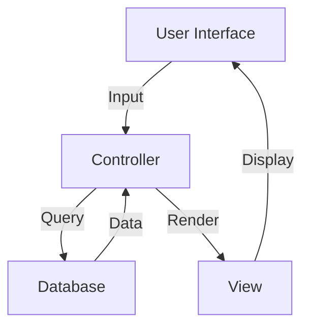

# Tonometry Module Documentation

## Overview & Purpose

The Tonometry Module is a comprehensive system for managing intraocular pressure (IOP) measurements in an ophthalmology electronic medical records system. It supports both air tonometry and applanation tonometry methods, along with pachymetry measurements.

## Table of Contents

1. [Overview & Purpose](#overview--purpose)
2. [Architecture & Design](#architecture--design)
3. [Dependencies](#dependencies)
4. [Features](#features)
5. [Technical Implementation](#technical-implementation)
6. [Usage Instructions](#usage-instructions)
7. [API Endpoints](#api-endpoints)
8. [Troubleshooting](#troubleshooting)

## Architecture & Design

The module follows the MVC (Model-View-Controller) pattern:

- **Model**: Database tables for storing tonometry and pachymetry measurements
- **View**: `tono.html` - Template for the tonometry interface
- **Controller**: `modalityctr.py` - Handles business logic and routing
- **JavaScript**: `tono_bt.js` - Client-side data handling and UI interactions

### Component Interaction Flow



## Dependencies

- **Frontend**:
  - Bootstrap Table 1.22
  - jQuery
  - Bootbox
  - Custom JS utilities

- **Backend**:
  - py4web framework
  - PyDAL (Database Abstraction Layer)

## Features

### 1. Air Tonometry

- Measurement input for both eyes
- Pachymetry recording
- Real-time data validation
- Historical data viewing

### 2. Applanation Tonometry

- Separate measurement input for both eyes
- Historical data tracking
- Data modification capabilities

### 3. Data Management

- Timestamp recording
- User tracking (created by/modified by)
- Data editing and deletion
- Value highlighting based on thresholds

## Technical Implementation

### Data Structure

```python
{
    'id': int,
    'id_auth_user': int,
    'id_worklist': int,
    'techno': str,  # 'air' or 'apla'
    'laterality': str,  # 'right' or 'left'
    'tonometry': float,
    'pachymetry': float,
    'timestamp': datetime,
    'modified_by': str,
    'created_by': str
}
```

### Value Thresholds

- **Tonometry**:
  - Warning: ≥ 20 mmHg
  - Alert: ≥ 24 mmHg

- **Pachymetry**:
  - Warning: ≤ 525 µm
  - Alert: ≤ 500 µm

## Usage Instructions

### Recording New Measurements

1. Select the eye (right/left)
2. Choose measurement type (air/applanation)
3. Enter tonometry value
4. For air tonometry, enter pachymetry value
5. Submit measurement

### Editing Measurements

1. Click the edit icon in the measurement history
2. Modify values in the modal form
3. Submit changes

### Deleting Measurements

1. Click the delete icon in the measurement history
2. Confirm deletion in the confirmation dialog

## API Endpoints

### GET Endpoints

- `/api/tono?laterality.eq=right&techno.eq=air` - Right eye air tonometry
- `/api/tono?laterality.eq=left&techno.eq=air` - Left eye air tonometry
- `/api/tono?laterality.eq=right&techno.eq=apla` - Right eye applanation
- `/api/tono?laterality.eq=left&techno.eq=apla` - Left eye applanation

Query Parameters:

- `@lookup`: Join related user information
- `@count`: Include total count
- `@order`: Sorting options
- `id_worklist.eq`: Filter by worklist ID

## Troubleshooting

### Common Issues

1. **Missing Data Display**
   - Check network connectivity
   - Verify API endpoint accessibility
   - Confirm user permissions

2. **Form Submission Errors**
   - Validate input formats
   - Check required fields
   - Verify CSRF token

3. **Table Loading Issues**
   - Clear browser cache
   - Check console for JavaScript errors
   - Verify Bootstrap Table initialization

### Error Prevention

- Input validation for numerical values
- Confirmation dialogs for destructive actions
- Visual feedback for abnormal values
- User action tracking
