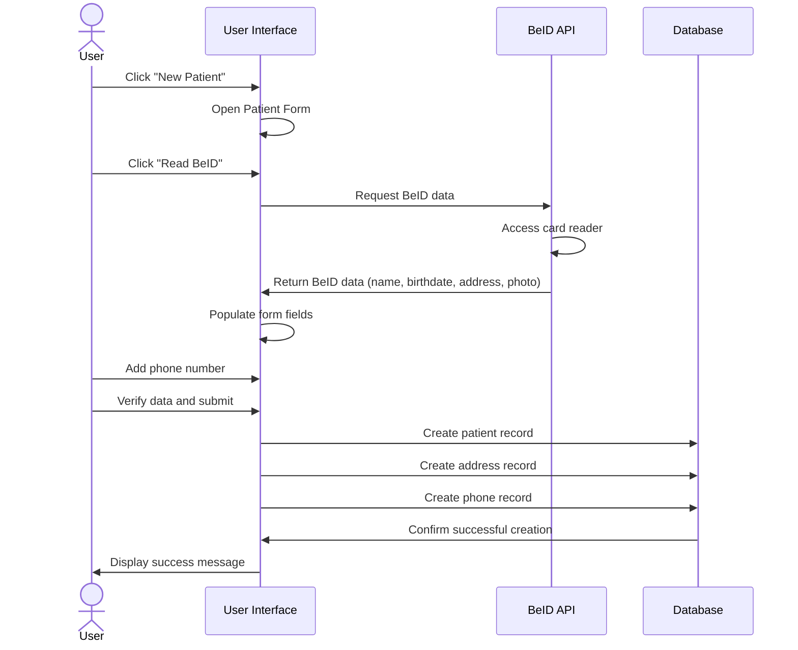
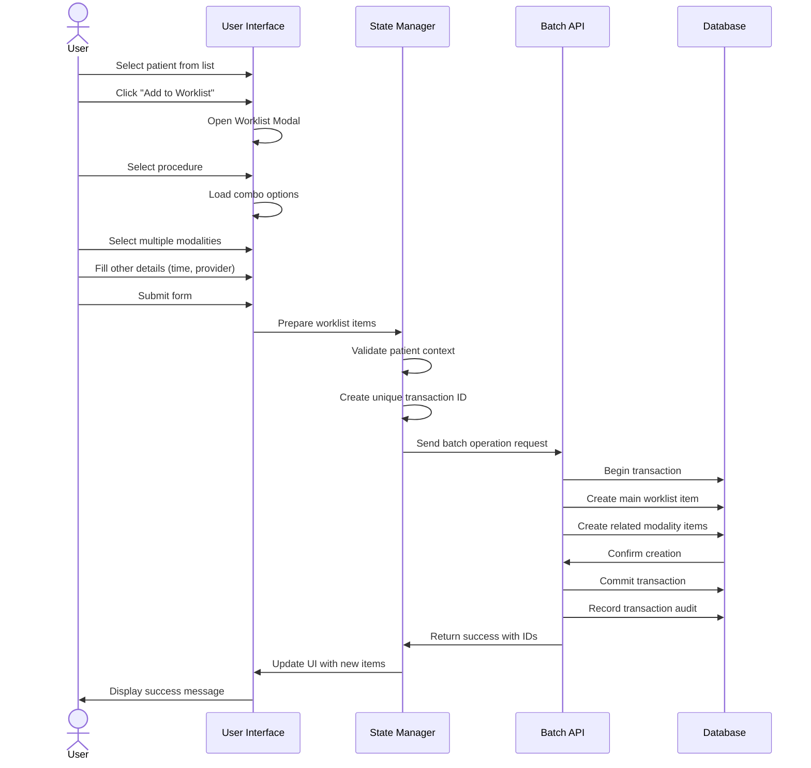

# Worklist Controller Documentation

## Overview

The Worklist controller is a critical component of the ophthalmology electronic medical records system. It manages patient appointments, procedure scheduling, workflow tracking, and modality-specific task management.

## File Structure

- `worklist.html`: Main view template
- `static/js/wl.js`: Core JavaScript functionality
- `static/js/wl_bt.js`: Bootstrap table configurations and handlers
- `static/js/wl-state-manager.js`: State management for worklist operations

## Key Workflows

### Patient Registration with BeID

The system supports patient registration using Belgian electronic ID cards (BeID):



### Adding a Combo to Worklist

Creating multiple related tasks using the combo feature:



## Features

### 1. Appointment Management

#### Patient Scheduling

- Patient registration
- Appointment booking
- Time slot management
- Provider assignment

#### Procedure Management

- Procedure type selection
- Modality assignment
- Laterality tracking (left/right/both eyes)
- Multiple modality handling

### 2. Workflow Tracking

#### Status Management

- Requested
- Processing
- Done
- Cancelled
- Doctor Done (for main modalities)

#### Time Tracking

- Waiting time monitoring
- Processing time tracking
- Status duration alerts
- Automatic refreshing

### 3. Provider Management

#### Staff Assignment

- Senior doctor assignment
- Provider assignment
- Facility management
- Role-based access control

### 4. Modality Integration

#### Modality Controllers

- Integration with various devices
- Controller-specific workflows
- Multiple modality support
- Device-specific task management

### 5. Facility Management

#### Facility Tracking

- Sending facility management
- Receiving facility management
- Inter-facility communication
- Location tracking

### 6. Combo Management

#### Atomic Operations

- Transaction-based combo creation
- Batch API support for atomic operations
- Transaction status tracking
- Error recovery mechanisms
- Transaction history and audit logs

## Technical Implementation

### Database Tables

The controller interacts with multiple database tables:

1. **Worklist Management**
   - `worklist`: Main worklist entries (includes transaction_id field)
   - `facility`: Facility information
   - `procedure`: Available procedures
   - `modality`: Equipment and devices
   - `auth_user`: User information

2. **Modality Management**
   - `modality_controller`: Device controllers
   - `combo`: Procedure combinations

3. **Transaction Management**
   - `transaction_audit`: Transaction tracking and status information

### Key Components

#### 1. Bootstrap Tables

The main worklist table (`table-wl`) implements:

- Server-side pagination
- Real-time refresh
- Status-based row coloring
- Detail view expansion
- Action buttons
- Search functionality
- Column sorting
- Time tracking

#### 2. Form Management

The worklist form handles:

- Patient selection
- Procedure assignment
- Provider selection
- Time slot booking
- Status management
- Counter tracking
- Warning messages

#### 3. State Management

The state management system (`wl-state-manager.js`) provides:

- Client-side state tracking for worklist items
- Request queueing to prevent race conditions
- UI protection during operations
- Transaction tracking and history
- Error recovery for failed operations
- Patient context validation

### JavaScript Functions

#### 1. Core Functions

```javascript
function queryParams_wl(params)
function responseHandler_wl(res)
function operateFormatter_wl(value, row, index)
function rowStyle_wl(row, value)
function detailFormatter_wl(index, row)
```

#### 2. Time Management

```javascript
function set_timers(timers)
function styleTimeslot(ts)
function counterFormatter_wl(value, row)
```

#### 3. Modality Management

```javascript
function setModalityOptions(procedureId)
function getModalityOptions(procedureId)
function getCombo(id_procedure)
```

#### 4. State Management

```javascript
class WorklistStateManager
class RequestQueue
class UIManager
```

### API Endpoints

The controller uses several API endpoints:

```javascript
const API_USER_LIST = HOSTURL + '/api/auth_user'
const API_PROCEDURE_LIST = HOSTURL + '/api/worklist'
const API_PROCEDURE_LIST_TODAY = HOSTURL + '/api/worklist'
const API_BATCH = HOSTURL + '/api/batch'
```

## Usage Guidelines

### 1. Appointment Creation

1. Select patient
2. Choose procedure
3. Assign providers
4. Select modality
5. Set time slot
6. Add to worklist

### 2. Workflow Management

1. Monitor status
2. Track waiting time
3. Update progress
4. Manage completion
5. Handle cancellations

### 3. Provider Assignment

1. Select senior doctor
2. Assign provider
3. Verify availability
4. Manage workload

### 4. Combo Creation

1. Select patient
2. Choose main procedure
3. Select multiple modalities from combo options
4. Submit the form
5. System creates all items as a single transaction
6. Transaction status is tracked and displayed
7. In case of failures, recovery options are provided

## Error Handling

The system implements:

- Form validation
- API error handling
- Status verification
- Time monitoring alerts
- User feedback messages
- Transaction rollback for failed batch operations
- Recovery mechanisms for partial transaction completion
- Detailed transaction status tracking

## Security Considerations

1. **Access Control**
   - Role-based access
   - Session management
   - Data validation
   - Action restrictions

2. **Data Protection**
   - Input sanitization
   - Secure API calls
   - Audit logging
   - Status tracking
   - Transaction boundaries
   - Atomic operations

## Dependencies

- Bootstrap Table 1.22
- jQuery
- Bootstrap 5
- Font Awesome
- Timer.jquery
- Bootbox

## Maintenance

Regular maintenance includes:

1. Monitoring refresh cycles
2. Updating facility information
3. Managing provider lists
4. Verifying modality controllers
5. Checking API endpoints
6. Updating documentation
7. Monitoring transaction audit logs
8. Verifying transaction completion rates

## Conclusion

The Worklist Controller provides:

1. Comprehensive appointment management
2. Real-time status tracking
3. Efficient workflow management
4. Modality integration
5. Provider coordination
6. Atomic transaction support for combo operations
7. Reliable data integrity through transaction handling

Regular updates ensure optimal functionality and user experience.
