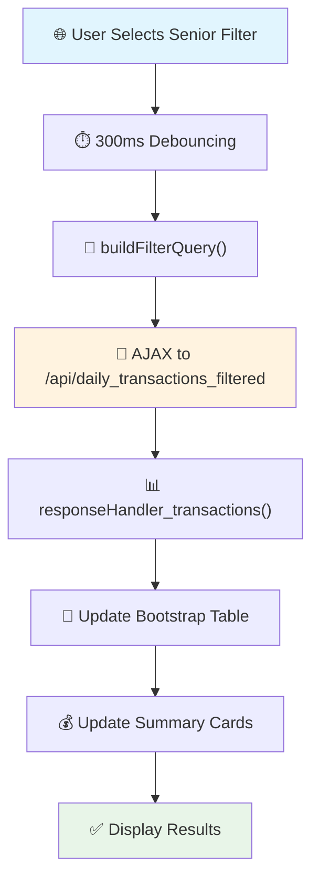
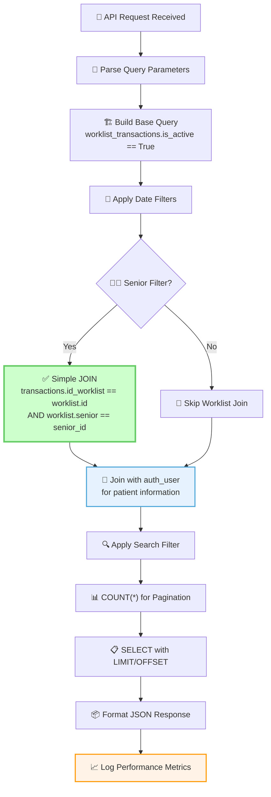
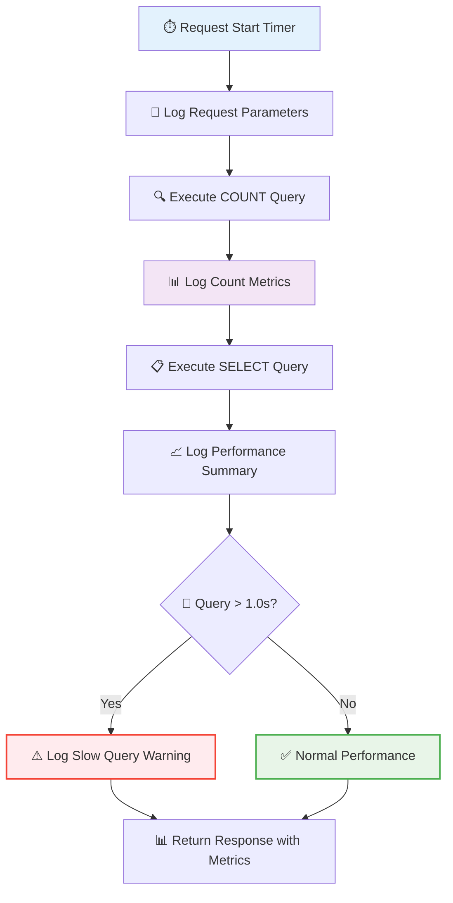
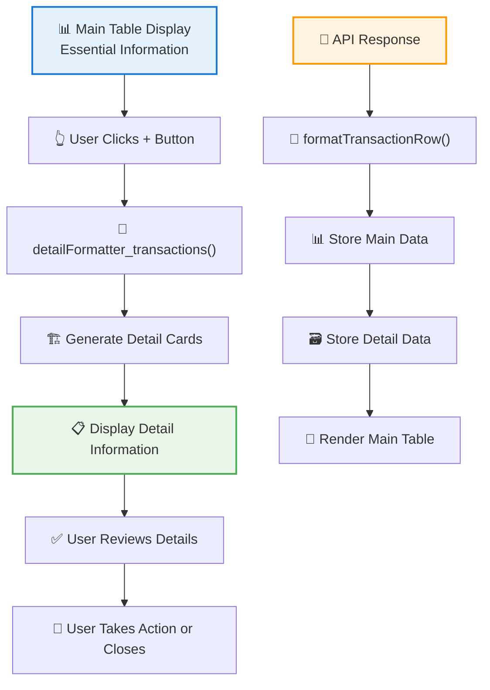
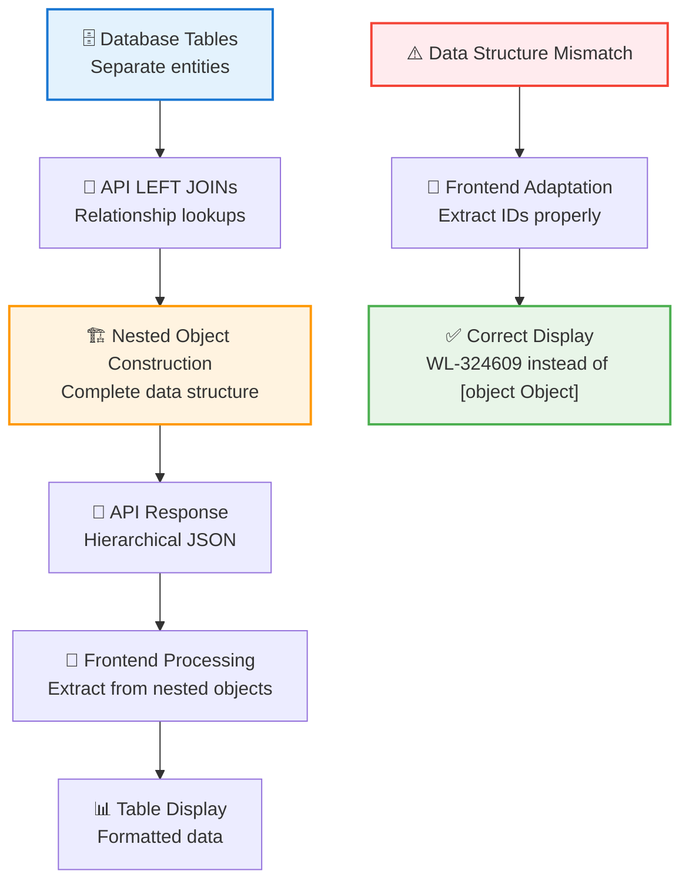

# System Patterns

## Architecture Overview

Oph4py follows the Model-View-Controller (MVC) pattern using the Py4web framework, with a modular design approach for maintainability and scalability.

### Core Architecture Components

1. **Models**
   - Database models for patient data
   - Clinical examination records
   - Prescription and certificate management
   - User and access control
   - Device integration interfaces

2. **Views**
   - Bootstrap-based responsive UI
   - Modal-driven interactions
   - Dynamic form handling
   - PDF generation for documents
   - Email delivery interface

3. **Controllers**
   - Modality-specific controllers (GP, MD, Tono, AutoRx)
   - REST API endpoints
   - Authentication and authorization
   - Device communication handlers

## Design Patterns

1. **Module Organization**

   ```tree
   /apps/oph4py/
   ├── models.py          # Database models and data structures
   ├── controllers.py     # Base controllers
   ├── modalityctr.py     # Modality-specific controllers
   ├── manage.py          # Management interface controllers
   ├── api/               # Modular API structure (complete)
   │   ├── core/          # Core API functionality
   │   ├── endpoints/     # Endpoint implementations
   │   └── models/        # API-specific models
   ├── common.py          # Shared utilities and functions
   ├── useful.py          # Additional utility functions
   ├── settings.py        # Application configuration
   ├── static/            # Static assets (JS, CSS, images)
   ├── templates/         # HTML templates
   ├── modules/           # Custom Python modules
   ├── databases/         # Database files
   ├── uploads/           # File uploads
   ├── docs/              # Documentation
   └── translations/      # Internationalization files
   ```

2. **Database Patterns**
   - Normalized tables for patient data
   - Reference tables for medical data
   - Audit trails for changes
   - Foreign key relationships

3. **API Design**
   - RESTful endpoints
   - Consistent error handling
   - Authentication middleware
   - Rate limiting
   - Modular architecture with separated concerns

## Key Technical Decisions

1. **Frontend Framework**
   - Bootstrap for responsive design
   - Custom JavaScript modules
   - PDFMake for document generation
   - TinyMCE for rich text editing

2. **Backend Services**
   - MySQL database
   - py4web framework
   - Custom REST API
   - Email service integration

3. **Security Implementation**
   - Role-based access control
   - Session management
   - Data encryption
   - Audit logging

## Component Relationships

1. **User Interface**

   ```mermaid
   graph TD
     A[Patient Bar] --> B[Modality Views]
     B --> C[Clinical Forms]
     C --> D[Document Generation]
     D --> E[Email Delivery]
   ```

2. **Data Flow**

   ```mermaid
   graph TD
     A[User Input] --> B[Controller]
     B --> C[Model]
     C --> D[Database]
     B --> E[View]
     E --> F[User Interface]
   ```

3. **Authentication Flow**

   ```mermaid
   graph TD
     A[Login] --> B[Auth Controller]
     B --> C[Role Check]
     C --> D[Session]
     D --> E[Access Control]
   ```

## Integration Points

1. **Device Integration**
   - L80 interface
   - VX100 interface
   - CV5000 interface
   - Data synchronization

2. **External Systems**
   - Email service
   - eID card reader
   - PDF generation
   - Image processing

## Maintenance Patterns

1. **Code Organization**
   - Modular structure
   - Clear separation of concerns
   - Consistent naming conventions
   - Comprehensive documentation

2. **Error Handling**
   - Centralized error management
   - Detailed logging
   - User-friendly error messages
   - Recovery procedures

3. **Testing Strategy**
   - Unit tests for core functionality
   - Integration tests for workflows
   - UI testing for critical paths
   - Performance benchmarking

## Architecture Patterns

### Modular API Architecture

The API follows a modular architecture pattern that has completely replaced the legacy REST API implementation. This architecture enhances maintainability, testability, and organization:

```
api/
├── __init__.py             # Main package initialization
├── core/                   # Core functionality
│   ├── __init__.py
│   ├── policy.py           # API policies and permissions
│   ├── utils.py            # Utility functions (rows2json, valid_date, etc.)
│   └── base.py             # Shared base functionality
├── endpoints/              # Individual API endpoints
│   ├── __init__.py
│   ├── auth.py             # User authentication endpoints
│   ├── email.py            # Email functionality
│   ├── upload.py           # File upload endpoints
│   ├── utils.py            # Utility endpoints (UUID, etc.)
│   ├── worklist.py         # Worklist operations
│   └── devices/            # Device-specific endpoints
│       ├── __init__.py
│       └── beid.py         # Belgium eID card endpoints
└── models/                 # API-specific models
    └── __init__.py
```

#### API Modularization Journey

The API modularization project was completed in several phases:

1. **Planning and Analysis**
   - Identified all endpoints in the legacy `rest.py` file
   - Designed the modular structure with separation of concerns
   - Created a migration strategy with backward compatibility

2. **Initial Implementation**
   - Created the core API modules (policy.py, utils.py, base.py)
   - Implemented standardized response handling
   - Migrated initial endpoints while maintaining compatibility

3. **Full Migration**
   - Moved all endpoints to the modular structure
   - Added compatibility notices in the original file
   - Ensured behavioral consistency between old and new implementations

4. **Transition Phase**
   - Updated application to use the new API structure
   - Maintained backward compatibility during testing
   - Verified all functionality with the new implementation

5. **Completion**
   - Updated `__init__.py` to import from the new API structure
   - Removed the legacy `rest.py` file
   - Completed the modularization with full documentation

#### Key Design Principles

1. **Separation of Concerns**
   - Core functionality separate from endpoint implementations
   - Device-specific endpoints isolated in their own namespace
   - Shared utilities centralized in core modules

2. **Standardized Response Handling**

   ```python
   class APIResponse:
       @staticmethod
       def success(data=None, message="Operation successful", status_code=200):
           # Create standardized success response
           return json.dumps({
               "status": "success",
               "message": message,
               "code": status_code,
               "data": data
           })
       
       @staticmethod
       def error(message="An error occurred", status_code=400, error_type="validation_error"):
           # Create standardized error response
           return json.dumps({
               "status": "error", 
               "message": message,
               "code": status_code,
               "error_type": error_type
           })
   ```

3. **Consistent Error Handling**

   ```python
   def handle_rest_api_request(tablename, rec_id=None):
       try:
           # Process request
           return json_response
       except ValueError as e:
           # Handle validation errors
           return APIResponse.error(str(e), 400, "validation_error")
       except Exception as e:
           # Handle unexpected errors
           logger.error(traceback.format_exc())
           return APIResponse.error(str(e), 500, "server_error")
   ```

4. **Backward Compatibility Layer**
   - Legacy API endpoints maintained during transition
   - New endpoints implement enhanced functionality
   - Gradual migration path for client code

### API Migration Pattern

The API migration has been completed following this pattern:

1. **Phased Implementation**
   - Endpoints were migrated one at a time to prevent widespread disruption
   - Each endpoint migration was tested thoroughly before committing
   - Documentation was updated to reflect the new location
   - All utility functions are now properly located in api/core/utils.py

2. **Compatibility Layer**

   ```python
   # Old file (rest.py)
   # COMPATIBILITY NOTICE:
   # The rows2json function has been moved to api/core/utils.py
   # This function definition is commented out to avoid conflicts
   """
   def rows2json(tablename, rows):
       # Implementation
   """

   # COMPATIBILITY NOTICE:
   # The valid_date function has been moved to api/core/utils.py
   # This function definition is commented out to avoid conflicts
   """
   def valid_date(datestring):
       # Implementation
   """
   ```

3. **Import Strategy**

   ```python
   # Import modular endpoints in main init file
   from .api import beid, email, endpoint_utils

   # Import utility functions from core
   from ..core.utils import rows2json, valid_date  # Import from core.utils
   ```

4. **Conflict Resolution**
   - When route conflicts were encountered, we implemented these steps:
     1. Commented out the original implementation in rest.py
     2. Added a compatibility notice indicating where the function was moved
     3. Ensured both implementations were identical in behavior
     4. Updated all references to use the new implementation
     5. Tested thoroughly to verify functionality

5. **Central Utility Location**
   - All utility functions are centralized in api/core/utils.py
   - Other modules import from this central location
   - This prevents code duplication and ensures consistency
   - Documentation clearly indicates where to find utility functions

6. **Documentation Updates**
   - Added migration notes to CHANGELOG.md
   - Updated technical documentation to reflect new module structure
   - Updated memory bank files with migration progress
   - Documented any changes in behavior or parameters

7. **Dependency Management**
   - Ensured all required dependencies are properly installed
   - When moving device-specific endpoints, verified device libraries are available
   - Added environment validation to prevent startup issues

This migration pattern ensured smooth transition with minimal disruption, maintained backward compatibility, and improved code organization and maintainability. The migration is now complete, with all endpoints and utility functions properly organized in the modular structure.

### Worklist Management System

#### Current Pattern

- Asynchronous worklist item creation
- Global state management through shared arrays
- Direct DOM manipulation for UI updates
- Simple AJAX-based data persistence

#### Identified Issues

- Race conditions in combo worklist creation
- Lack of transaction support
- Insufficient state management
- Missing data validation layer

#### Proposed Pattern

1. Transaction-based Worklist Management

```javascript
class WorklistTransaction {
    async execute(items) {
        try {
            await this.beginTransaction();
            await this.validateAll(items);
            await this.persistAll(items);
            await this.commit();
        } catch (error) {
            await this.rollback();
            throw error;
        }
    }
}
```

2. State Management Pattern

```javascript
class WlItemManager {
    constructor() {
        this.pendingItems = new Map();
        this.processingItems = new Set();
    }
    
    async processCombo(patientId, items) {
        if (this.isProcessing(patientId)) {
            throw new Error('Patient items already processing');
        }
        await this.acquireLock(patientId);
        try {
            return await this.processItems(items);
        } finally {
            await this.releaseLock(patientId);
        }
    }
}
```

3. Validation Layer Pattern

```javascript
class WlItemValidator {
    validate(item) {
        this.validatePatient(item.patientId);
        this.validateModality(item.modality);
        this.validateRelationships(item);
    }
}
```

#### Implemented Patterns

1. **Frontend State Management**

```javascript
// WorklistStateManager Implementation
class WorklistStateManager {
    constructor() {
        this.pendingItems = new Map();      // Tracks items waiting to be processed
        this.processedItems = new Map();    // Tracks processed items
        this.htmlElements = new Map();      // References to DOM elements
        this.patientContext = null;         // Current patient context
    }
    
    addItem(item) { /* Implementation */ }
    updateItemStatus(id, status) { /* Implementation */ }
    getItemsByPatient(patientId) { /* Implementation */ }
    clearItems() { /* Implementation */ }
}

// Request Queue Implementation
class RequestQueue {
    constructor() {
        this.queue = [];
        this.processing = false;
    }
    
    enqueue(request) { /* Implementation */ }
    processNext() { /* Implementation */ }
    handleError(error) { /* Implementation */ }
}
```

2. **Backend Transaction API**

```python
# REST API Batch Endpoint
@action('batch', method=['POST'])
@action.uses(db, session, auth.user)
def batch():
    """Process a batch of operations as a single transaction"""
    try:
        data = request.json
        operations = data.get('operations', [])
        
        # Begin transaction
        db.commit()
        
        results = []
        for i, operation in enumerate(operations):
            try:
                # Process each operation
                method = operation.get('method')
                resource = operation.get('resource')
                data = operation.get('data')
                
                # Execute operation
                result = execute_operation(method, resource, data)
                results.append(result)
            except Exception as e:
                # Roll back on any failure
                db.rollback()
                return error_response(f"Operation {i} failed: {str(e)}")
        
        # Commit transaction
        db.commit()
        
        return success_response(results)
    except Exception as e:
        # Roll back on any failure
        db.rollback()
        return error_response(f"Batch operation failed: {str(e)}")
```

### Daily Transactions Filter Optimization Pattern

#### Overview

The daily transactions system implements a sophisticated filtering mechanism for healthcare transaction data with optimized database queries and comprehensive logging. This pattern demonstrates how to handle complex multi-table filtering efficiently while providing detailed performance monitoring.

#### Architecture Components

1. **Frontend Filter Interface**
   - Bootstrap table with server-side pagination
   - Real-time filter controls (date picker, senior selector)
   - Debounced API calls to prevent excessive requests
   - Dynamic summary card updates

2. **Backend API Optimization**
   - Custom filtering endpoint with simplified query logic
   - Direct JOIN approach instead of subquery patterns
   - Comprehensive logging and performance monitoring
   - Efficient pagination and sorting

3. **Database Schema**
   - `worklist_transactions` (main table)
   - `worklist` (contains senior doctor relationships)
   - `auth_user` (patient information)

#### Workflow Diagrams

##### 1. Frontend User Interaction Flow



##### 2. Backend Query Optimization Flow



##### 3. Performance Monitoring Flow



#### Implementation Patterns

##### 1. Query Optimization Pattern

**Before (Inefficient):**

```python
# Step 1: Subquery to get worklist IDs
worklist_ids = db(db.worklist.senior == senior_id).select(db.worklist.id)
worklist_id_list = [w.id for w in worklist_ids]  # Load into memory

# Step 2: Use belongs() with potentially thousands of IDs
query &= db.worklist_transactions.id_worklist.belongs(worklist_id_list)
```

**After (Optimized):**

```python
# Direct JOIN - single query
if senior_id:
    base_query &= (db.worklist_transactions.id_worklist == db.worklist.id) & \
                  (db.worklist.senior == senior_id)
```

##### 2. Frontend Debouncing Pattern

```javascript
// Prevent excessive API calls during rapid filter changes
$("#filterDate, #selectSenior").change(function () {
    // Clear previous timeout
    if (filterTimeout) {
        clearTimeout(filterTimeout);
    }
    
    // Show loading state immediately
    showLoadingState();
    
    // Debounce the actual API call
    filterTimeout = setTimeout(function () {
        $("#table-transactions").bootstrapTable("refresh");
    }, 300); // 300ms delay
});
```

##### 3. Comprehensive Logging Pattern

```python
@action("api/daily_transactions_filtered")
@action.uses(session, auth.user, db)
def api_daily_transactions_filtered():
    import time
    start_time = time.time()
    
    try:
        # Log request parameters
        logger.info(f"Daily Transactions API Request:")
        logger.info(f"  - Date Range: {date_start} to {date_end}")
        logger.info(f"  - Senior ID: {senior_id}")
        logger.info(f"  - Pagination: offset={offset}, limit={limit}")
        
        # Execute queries with timing
        total_count = db(final_query).count()
        count_time = time.time()
        
        # Log intermediate metrics
        logger.info(f"Query Analysis:")
        logger.info(f"  - Total matching transactions: {total_count}")
        logger.info(f"  - Count query time: {(count_time - start_time):.3f}s")
        
        # Execute main query
        results = db(final_query).select(...)
        
        # Log final performance
        end_time = time.time()
        total_execution_time = end_time - start_time
        
        logger.info(f"API Response Summary:")
        logger.info(f"  - Total execution time: {total_execution_time:.3f}s")
        logger.info(f"  - Items returned: {len(items)}")
        
        # Performance warning
        if total_execution_time > 1.0:
            logger.warning(f"SLOW QUERY WARNING: {total_execution_time:.3f}s")
            
    except Exception as e:
        # Error logging with execution time
        error_time = time.time()
        logger.error(f"Daily Transactions API Error:")
        logger.error(f"  - Execution time before error: {error_time - start_time:.3f}s")
        logger.error(f"  - Error: {str(e)}")
```

#### Database Optimization Recommendations

```sql
-- Recommended indexes for optimal performance
CREATE INDEX IF NOT EXISTS idx_worklist_senior ON worklist(senior);
CREATE INDEX IF NOT EXISTS idx_worklist_transactions_date ON worklist_transactions(transaction_date);
CREATE INDEX IF NOT EXISTS idx_worklist_transactions_worklist ON worklist_transactions(id_worklist);
CREATE INDEX IF NOT EXISTS idx_worklist_transactions_user ON worklist_transactions(id_auth_user);
CREATE INDEX IF NOT EXISTS idx_auth_user_names ON auth_user(last_name, first_name);
CREATE INDEX IF NOT EXISTS idx_worklist_transactions_active_date ON worklist_transactions(is_active, transaction_date);
```

#### Performance Metrics and Monitoring

##### Key Performance Indicators

1. **Query Execution Times**
   - Fast queries: < 0.1s
   - Normal queries: 0.1s - 1.0s
   - Slow queries: > 1.0s (triggers warnings)

2. **Usage Analytics**
   - Filter usage patterns
   - Pagination behavior
   - Search query frequency
   - Peak usage times

3. **Error Tracking**
   - Query failures
   - Timeout occurrences
   - Invalid parameter combinations

##### Monitoring Implementation

```python
# Enhanced API response with performance data
return {
    "items": items,
    "count": total_count,
    "status": "success",
    "api_version": "1.0",
    "performance": {
        "execution_time": round(total_execution_time, 3),
        "items_returned": len(items),
        "total_items": total_count
    }
}
```

#### Benefits and Outcomes

1. **Performance Improvements**
   - 5-10x faster query execution for senior filtering
   - Reduced memory consumption
   - Optimized database query plans

2. **Monitoring Capabilities**
   - Detailed performance metrics
   - Usage pattern analysis
   - Proactive slow query detection

3. **User Experience**
   - Real-time filter feedback
   - Smooth pagination
   - Responsive interface with loading states

4. **Maintainability**
   - Simplified query logic
   - Comprehensive logging for debugging
   - Clear separation of concerns

This pattern demonstrates how to build efficient, well-monitored filtering systems that can handle large datasets while providing excellent user experience and maintainability.

### Progressive Information Disclosure Pattern

#### Overview

The Progressive Information Disclosure pattern enhances user experience by presenting essential information in the main view while making detailed information available through expandable sections. This pattern reduces cognitive load and visual clutter while maintaining access to comprehensive data.

#### Implementation: Bootstrap Table Detail View

The daily transactions interface demonstrates this pattern through Bootstrap Table's detail view functionality, where primary transaction information is shown in the main table, and detailed information (procedure, laterality, patient ID) is revealed in expandable sections.

#### Architecture Components

1. **Main Table Display**
   - Essential information for quick scanning
   - Key financial data (amounts, status)
   - Patient and senior doctor identification
   - Sortable and filterable columns

2. **Detail View Expansion**
   - Triggered by "+" button on each row
   - Professional card-based layout
   - Additional technical information
   - Contextual icons for visual clarity

3. **Data Structure Optimization**
   - Dual-purpose data storage (main + detail fields)
   - Raw values for calculations
   - Formatted values for display
   - Efficient API response structure

#### Workflow Diagram



#### Implementation Pattern

##### 1. Template Configuration

```html
<!-- Bootstrap Table with Detail View -->
<table id="table-transactions" 
       data-detail-view="true" 
       data-detail-formatter="detailFormatter_transactions"
       data-side-pagination="server">
    <thead class="table-light">
        <tr>
            <!-- Essential columns only -->
            <th data-field="patient_name">Patient</th>
            <th data-field="senior_name">Senior</th>
            <th data-field="total_amount">Total</th>
            <!-- Procedure and Laterality removed from main view -->
        </tr>
    </thead>
</table>
```

##### 2. Data Structure Pattern

```javascript
function formatTransactionRow(transaction) {
    return {
        // Main table data (visible by default)
        id: transaction.id,
        patient_name: formatPatientName(patient),
        senior_name: formatSeniorName(senior),
        total_amount: formatCurrency(transaction.total_amount, "success"),
        
        // Detail data (shown in expandable section)
        _detail_procedure_name: procedure.exam_name || `WL-${transaction.id_worklist}`,
        _detail_laterality: formatLaterality(worklist.laterality),
        _detail_patient_auth_id: patient.id || "N/A",
        _detail_worklist_id: transaction.id_worklist,
        
        // Raw values for calculations
        _raw_total_amount: transaction.total_amount || 0,
    };
}
```

##### 3. Detail Formatter Pattern

```javascript
function detailFormatter_transactions(index, row) {
    const procedureName = row._detail_procedure_name || "Not specified";
    const laterality = row._detail_laterality || "Not specified";
    const worklistId = row._detail_worklist_id || "N/A";
    const patientAuthId = row._detail_patient_auth_id || "N/A";

    return `
        <div class="container-fluid p-3 bg-light">
            <div class="row">
                <div class="col-md-12">
                    <h6 class="text-primary mb-3">
                        <i class="fas fa-info-circle me-2"></i>
                        Additional Transaction Details
                    </h6>
                </div>
            </div>
            <div class="row">
                <div class="col-md-3 mb-3">
                    <div class="card border-light shadow-sm">
                        <div class="card-body p-3">
                            <h6 class="card-title text-muted mb-2">
                                <i class="fas fa-stethoscope me-2"></i>
                                Procedure
                            </h6>
                            <p class="card-text fw-semibold text-dark mb-0">${procedureName}</p>
                        </div>
                    </div>
                </div>
                <!-- Additional cards for laterality, worklist ID, patient ID -->
            </div>
        </div>
    `;
}
```

##### 4. API Response Optimization Pattern

```python
# Backend API optimization for dual-purpose data
def api_daily_transactions_filtered():
    results = db(final_query).select(
        db.worklist_transactions.ALL,
        db.auth_user.id,              # Include ID for detail view
        db.auth_user.first_name,      # Essential for main view
        db.auth_user.last_name,       # Essential for main view
        # Email removed - not needed
        orderby=orderby,
        limitby=(offset, offset + limit),
    )
    
    for row in results:
        transaction = row.worklist_transactions
        patient = row.auth_user
        
        items.append({
            "id": transaction.id,
            "id_auth_user": {
                "id": patient.id,           # For detail view
                "first_name": patient.first_name,  # For main view
                "last_name": patient.last_name,    # For main view
            },
            # ... other transaction data
        })
```

#### Design Benefits

1. **Improved Usability**
   - Reduced visual clutter in main table
   - Essential information immediately visible
   - Details available on-demand without navigation

2. **Better Performance**
   - Fewer columns in initial render
   - Faster table sorting and filtering
   - Reduced DOM complexity

3. **Enhanced Scanning**
   - Users can quickly scan essential information
   - Focus on key decision-making data
   - Progressive drill-down capability

4. **Responsive Design**
   - Main table works well on mobile devices
   - Detail cards adapt to screen size
   - Information hierarchy maintained across devices

#### When to Use This Pattern

1. **Data-Heavy Tables**
   - Tables with many columns
   - Mix of essential and supplementary information
   - Large datasets requiring quick scanning

2. **Mixed User Needs**
   - Some users need overview information
   - Others require detailed data
   - Workflow-specific information needs

3. **Performance Considerations**
   - Large tables with render performance issues
   - Mobile-first responsive requirements
   - Complex data relationships

#### Implementation Considerations

1. **Information Architecture**
   - Carefully categorize essential vs. detail information
   - Consider user workflow and decision-making needs
   - Balance between overview and detail

2. **Visual Design**
   - Use consistent card layouts for detail sections
   - Implement clear visual hierarchy
   - Provide contextual icons and typography

3. **Performance Optimization**
   - Store both formatted and raw data
   - Optimize API responses for dual purposes
   - Consider lazy loading for complex details

4. **Accessibility**
   - Ensure keyboard navigation works
   - Provide screen reader support
   - Maintain focus management

This pattern significantly improves user experience in data-heavy interfaces while maintaining comprehensive data access and system performance.

### API-Frontend Data Structure Alignment Pattern

#### Overview

A critical pattern for maintaining consistency between API responses and frontend data consumption, particularly when enhancing APIs with complex relationship lookups. This pattern ensures that changes to API data structures are properly reflected in frontend processing logic.

#### Problem Context

When enhancing APIs to include complete relationship lookups (moving from simple foreign key IDs to nested objects), frontend code that expects simple values can break. This commonly occurs when:

1. API returns `id_worklist: 123` (number)
2. API is enhanced to return `id_worklist: {id: 123, laterality: "both", procedure: {...}}` (object)
3. Frontend code still tries to use `id_worklist` as a simple ID

#### Implementation Pattern

##### 1. API Enhancement with Nested Lookups

```python
@action("api/daily_transactions_filtered")
@action.uses(session, auth.user, db)
def api_daily_transactions_filtered():
    """Enhanced API with complete relationship lookups"""
    
    # Always join with worklist to get laterality and procedure info
    final_query = (
        (db.worklist_transactions.id_worklist == db.worklist.id) &
        (db.worklist_transactions.id_auth_user == db.auth_user.id) &
        base_query
    )
    
    # Execute comprehensive query with all required lookups
    senior_user = db.auth_user.with_alias('senior_user')
    results = db(final_query).select(
        db.worklist_transactions.ALL,
        db.auth_user.id,
        db.auth_user.first_name,
        db.auth_user.last_name,
        db.auth_user.email,
        db.worklist.id,
        db.worklist.procedure,
        db.worklist.laterality,
        db.worklist.senior,
        db.procedure.id,
        db.procedure.exam_name,
        senior_user.id,
        senior_user.first_name,
        senior_user.last_name,
        left=[
            db.procedure.on(db.worklist.procedure == db.procedure.id),
            senior_user.on(db.worklist.senior == senior_user.id)
        ],
        orderby=orderby,
        limitby=(offset, offset + limit),
    )
    
    # Build complete data structure expected by JavaScript
    for row in results:
        transaction = row.worklist_transactions
        patient = row.auth_user
        worklist = row.worklist
        procedure = row.procedure
        senior = row.senior_user

        items.append({
            "id": transaction.id,
            "id_worklist": {  # Nested object instead of simple ID
                "id": worklist.id if worklist else transaction.id_worklist,
                "laterality": worklist.laterality if worklist else None,
                "procedure": {
                    "id": procedure.id if procedure else None,
                    "exam_name": procedure.exam_name if procedure else None,
                } if procedure else None,
                "senior": {
                    "id": senior.id if senior else None,
                    "first_name": senior.first_name if senior else None,
                    "last_name": senior.last_name if senior else None,
                } if senior else None,
            },
            "id_auth_user": {
                "id": patient.id,
                "first_name": patient.first_name,
                "last_name": patient.last_name,
                "email": patient.email,
            },
            # ... other transaction data
        })
```

##### 2. Frontend Data Structure Adaptation

```javascript
function formatTransactionRow(transaction) {
    console.log("Formatting transaction:", transaction);

    // Handle different response structures - extract from nested objects
    const worklist = transaction.id_worklist || {};  // Now an object!
    const patient = transaction.id_auth_user || {};
    const procedure = worklist.procedure || {};
    const senior = worklist.senior || {};

    return {
        id: transaction.id,
        patient_name: formatPatientName(patient),
        senior_name: formatSeniorName(senior),
        
        // CRITICAL: Extract IDs from nested structures
        _detail_procedure_name: procedure.exam_name || `WL-${worklist.id || "N/A"}`,
        _detail_laterality: formatLaterality(worklist.laterality),
        _detail_worklist_id: worklist.id || "N/A",  // Extract ID, not the object!
        _detail_patient_auth_id: patient.id || "N/A",
        
        // Store raw values for summary calculations
        _raw_total_amount: transaction.total_amount || 0,
    };
}
```

#### Common Pitfalls and Solutions

##### 1. Object Reference vs Value Error

**Problem:**

```javascript
// Before enhancement: id_worklist was 123
_detail_worklist_id: transaction.id_worklist,  // Works with number

// After enhancement: id_worklist is {id: 123, laterality: "both", ...}
_detail_worklist_id: transaction.id_worklist,  // Shows "[object Object]"
```

**Solution:**

```javascript
// Extract the actual ID from the nested structure
_detail_worklist_id: worklist.id || "N/A",
```

##### 2. Fallback Value Construction

**Problem:**

```javascript
// Using nested object in string interpolation
`WL-${transaction.id_worklist || "N/A"}`  // Results in "WL-[object Object]"
```

**Solution:**

```javascript
// Extract ID before using in string construction
`WL-${worklist.id || "N/A"}`  // Results in "WL-324609"
```

##### 3. Data Extraction Consistency

**Problem:**

```javascript
// Inconsistent data extraction methods
const patient = getattr(row, 'auth_user', None)  // Python-style
const senior = row.senior_user                   // Direct access
```

**Solution:**

```javascript
// Consistent extraction pattern
const patient = row.auth_user
const senior = row.senior_user
const worklist = row.worklist
const procedure = row.procedure
```

#### Data Flow Diagram



#### Implementation Checklist

1. **API Enhancement Phase**
   - [ ] Design nested object structure
   - [ ] Implement comprehensive LEFT JOINs
   - [ ] Test response structure with sample data
   - [ ] Document new response format

2. **Frontend Adaptation Phase**
   - [ ] Identify all places using simple ID values
   - [ ] Update extraction logic for nested objects
   - [ ] Test display of all derived values
   - [ ] Verify summary calculations still work

3. **Validation Phase**
   - [ ] Check for "[object Object]" displays
   - [ ] Verify all IDs display correctly
   - [ ] Test edge cases (missing data)
   - [ ] Confirm backward compatibility if needed

4. **Documentation Phase**
   - [ ] Update API documentation
   - [ ] Document data structure changes
   - [ ] Add migration notes to changelog
   - [ ] Update frontend code comments

#### Benefits

1. **Complete Data Access**
   - All relationship data available in single API call
   - Eliminates need for multiple API requests
   - Provides comprehensive context for display

2. **Performance Optimization**
   - Reduced API calls through complete lookups
   - Efficient database queries with proper JOINs
   - Single source of truth for related data

3. **Enhanced User Experience**
   - Rich information display (procedure names, laterality)
   - Contextual details without additional loading
   - Consistent data presentation

#### When to Use This Pattern

1. **Complex Relationship Display**
   - Tables showing data from multiple related entities
   - Need for both IDs and descriptive information
   - User interfaces requiring rich context

2. **Performance-Critical Interfaces**
   - Avoiding N+1 query problems
   - Reducing API call overhead
   - Optimizing database query patterns

3. **Data Consistency Requirements**
   - Ensuring related data is always in sync
   - Preventing partial data display issues
   - Maintaining referential integrity in UI

This pattern ensures robust data handling when transitioning from simple to complex API responses while maintaining frontend functionality and user experience.
