# System Patterns

## Architecture Overview

Oph4py follows the Model-View-Controller (MVC) pattern using the Py4web framework, with a modular design approach for maintainability and scalability.

### Core Architecture Components

1. **Models**
   - Database models for patient data
   - Clinical examination records
   - Prescription and certificate management
   - User and access control
   - Device integration interfaces

2. **Views**
   - Bootstrap-based responsive UI
   - Modal-driven interactions
   - Dynamic form handling
   - PDF generation for documents
   - Email delivery interface

3. **Controllers**
   - Modality-specific controllers (GP, MD, Tono, AutoRx)
   - REST API endpoints
   - Authentication and authorization
   - Device communication handlers

## Design Patterns

1. **Module Organization**

   ```tree
   /apps/oph4py/
   ├── models.py          # Database models and data structures
   ├── controllers.py     # Base controllers
   ├── modalityctr.py     # Modality-specific controllers
   ├── manage.py          # Management interface controllers
   ├── api/               # Modular API structure (complete)
   │   ├── core/          # Core API functionality
   │   ├── endpoints/     # Endpoint implementations
   │   └── models/        # API-specific models
   ├── common.py          # Shared utilities and functions
   ├── useful.py          # Additional utility functions
   ├── settings.py        # Application configuration
   ├── static/            # Static assets (JS, CSS, images)
   ├── templates/         # HTML templates
   ├── modules/           # Custom Python modules
   ├── databases/         # Database files
   ├── uploads/           # File uploads
   ├── docs/              # Documentation
   └── translations/      # Internationalization files
   ```

2. **Database Patterns**
   - Normalized tables for patient data
   - Reference tables for medical data
   - Audit trails for changes
   - Foreign key relationships

3. **API Design**
   - RESTful endpoints
   - Consistent error handling
   - Authentication middleware
   - Rate limiting
   - Modular architecture with separated concerns

## Key Technical Decisions

1. **Frontend Framework**
   - Bootstrap for responsive design
   - Custom JavaScript modules
   - PDFMake for document generation
   - TinyMCE for rich text editing

2. **Backend Services**
   - MySQL database
   - py4web framework
   - Custom REST API
   - Email service integration

3. **Security Implementation**
   - Role-based access control
   - Session management
   - Data encryption
   - Audit logging

## Component Relationships

1. **User Interface**

   ```mermaid
   graph TD
     A[Patient Bar] --> B[Modality Views]
     B --> C[Clinical Forms]
     C --> D[Document Generation]
     D --> E[Email Delivery]
   ```

2. **Data Flow**

   ```mermaid
   graph TD
     A[User Input] --> B[Controller]
     B --> C[Model]
     C --> D[Database]
     B --> E[View]
     E --> F[User Interface]
   ```

3. **Authentication Flow**

   ```mermaid
   graph TD
     A[Login] --> B[Auth Controller]
     B --> C[Role Check]
     C --> D[Session]
     D --> E[Access Control]
   ```

## Integration Points

1. **Device Integration**
   - L80 interface
   - VX100 interface
   - CV5000 interface
   - Data synchronization

2. **External Systems**
   - Email service
   - eID card reader
   - PDF generation
   - Image processing

## Maintenance Patterns

1. **Code Organization**
   - Modular structure
   - Clear separation of concerns
   - Consistent naming conventions
   - Comprehensive documentation

2. **Error Handling**
   - Centralized error management
   - Detailed logging
   - User-friendly error messages
   - Recovery procedures

3. **Testing Strategy**
   - Unit tests for core functionality
   - Integration tests for workflows
   - UI testing for critical paths
   - Performance benchmarking

## Architecture Patterns

### Modular API Architecture

The API follows a modular architecture pattern that has completely replaced the legacy REST API implementation. This architecture enhances maintainability, testability, and organization:

```
api/
├── __init__.py             # Main package initialization
├── core/                   # Core functionality
│   ├── __init__.py
│   ├── policy.py           # API policies and permissions
│   ├── utils.py            # Utility functions (rows2json, valid_date, etc.)
│   └── base.py             # Shared base functionality
├── endpoints/              # Individual API endpoints
│   ├── __init__.py
│   ├── auth.py             # User authentication endpoints
│   ├── email.py            # Email functionality
│   ├── upload.py           # File upload endpoints
│   ├── utils.py            # Utility endpoints (UUID, etc.)
│   ├── worklist.py         # Worklist operations
│   └── devices/            # Device-specific endpoints
│       ├── __init__.py
│       └── beid.py         # Belgium eID card endpoints
└── models/                 # API-specific models
    └── __init__.py
```

#### API Modularization Journey

The API modularization project was completed in several phases:

1. **Planning and Analysis**
   - Identified all endpoints in the legacy `rest.py` file
   - Designed the modular structure with separation of concerns
   - Created a migration strategy with backward compatibility

2. **Initial Implementation**
   - Created the core API modules (policy.py, utils.py, base.py)
   - Implemented standardized response handling
   - Migrated initial endpoints while maintaining compatibility

3. **Full Migration**
   - Moved all endpoints to the modular structure
   - Added compatibility notices in the original file
   - Ensured behavioral consistency between old and new implementations

4. **Transition Phase**
   - Updated application to use the new API structure
   - Maintained backward compatibility during testing
   - Verified all functionality with the new implementation

5. **Completion**
   - Updated `__init__.py` to import from the new API structure
   - Removed the legacy `rest.py` file
   - Completed the modularization with full documentation

#### Key Design Principles

1. **Separation of Concerns**
   - Core functionality separate from endpoint implementations
   - Device-specific endpoints isolated in their own namespace
   - Shared utilities centralized in core modules

2. **Standardized Response Handling**

   ```python
   class APIResponse:
       @staticmethod
       def success(data=None, message="Operation successful", status_code=200):
           # Create standardized success response
           return json.dumps({
               "status": "success",
               "message": message,
               "code": status_code,
               "data": data
           })
       
       @staticmethod
       def error(message="An error occurred", status_code=400, error_type="validation_error"):
           # Create standardized error response
           return json.dumps({
               "status": "error", 
               "message": message,
               "code": status_code,
               "error_type": error_type
           })
   ```

3. **Consistent Error Handling**

   ```python
   def handle_rest_api_request(tablename, rec_id=None):
       try:
           # Process request
           return json_response
       except ValueError as e:
           # Handle validation errors
           return APIResponse.error(str(e), 400, "validation_error")
       except Exception as e:
           # Handle unexpected errors
           logger.error(traceback.format_exc())
           return APIResponse.error(str(e), 500, "server_error")
   ```

4. **Backward Compatibility Layer**
   - Legacy API endpoints maintained during transition
   - New endpoints implement enhanced functionality
   - Gradual migration path for client code

### API Migration Pattern

The API migration has been completed following this pattern:

1. **Phased Implementation**
   - Endpoints were migrated one at a time to prevent widespread disruption
   - Each endpoint migration was tested thoroughly before committing
   - Documentation was updated to reflect the new location
   - All utility functions are now properly located in api/core/utils.py

2. **Compatibility Layer**

   ```python
   # Old file (rest.py)
   # COMPATIBILITY NOTICE:
   # The rows2json function has been moved to api/core/utils.py
   # This function definition is commented out to avoid conflicts
   """
   def rows2json(tablename, rows):
       # Implementation
   """

   # COMPATIBILITY NOTICE:
   # The valid_date function has been moved to api/core/utils.py
   # This function definition is commented out to avoid conflicts
   """
   def valid_date(datestring):
       # Implementation
   """
   ```

3. **Import Strategy**

   ```python
   # Import modular endpoints in main init file
   from .api import beid, email, endpoint_utils

   # Import utility functions from core
   from ..core.utils import rows2json, valid_date  # Import from core.utils
   ```

4. **Conflict Resolution**
   - When route conflicts were encountered, we implemented these steps:
     1. Commented out the original implementation in rest.py
     2. Added a compatibility notice indicating where the function was moved
     3. Ensured both implementations were identical in behavior
     4. Updated all references to use the new implementation
     5. Tested thoroughly to verify functionality

5. **Central Utility Location**
   - All utility functions are centralized in api/core/utils.py
   - Other modules import from this central location
   - This prevents code duplication and ensures consistency
   - Documentation clearly indicates where to find utility functions

6. **Documentation Updates**
   - Added migration notes to CHANGELOG.md
   - Updated technical documentation to reflect new module structure
   - Updated memory bank files with migration progress
   - Documented any changes in behavior or parameters

7. **Dependency Management**
   - Ensured all required dependencies are properly installed
   - When moving device-specific endpoints, verified device libraries are available
   - Added environment validation to prevent startup issues

This migration pattern ensured smooth transition with minimal disruption, maintained backward compatibility, and improved code organization and maintainability. The migration is now complete, with all endpoints and utility functions properly organized in the modular structure.

### Practitioner Selector Pattern

The practitioner selector pattern provides consistent filtering capabilities across modules with intelligent defaults for improved user workflow.

#### Pattern Implementation

1. **Backend Data Generation Pattern**

```python
# Controller pattern for practitioner/provider data
def controller_with_practitioner_selectors():
    # Generate practitioner dictionary (doctors only)
    practitionerDict = {}
    practitionerSelect = ["Doctor"]
    rows = db(db.membership.membership.contains(practitionerSelect, all=False)).select(
        join=db.auth_user.on(db.auth_user.membership == db.membership.id)
    )
    for row in rows:
        practitionerDict[
            "Dr. " + row.auth_user.first_name + " " + row.auth_user.last_name
        ] = row.auth_user.id

    # Generate provider dictionary (all medical staff)
    providerDict = {}
    providerSelect = ["Doctor", "Provider", "Technician", "Nurse", "Student"]
    rows = db(db.membership.membership.contains(providerSelect, all=False)).select(
        join=db.auth_user.on(db.auth_user.membership == db.membership.id)
    )
    for row in rows:
        providerDict[
            row.auth_user.first_name + " " + row.auth_user.last_name
        ] = row.auth_user.id

    # Get current user membership for smart defaults
    userMembership = ""
    if auth.get_user():
        user_membership_row = db(db.membership.id == auth.get_user()["membership"]).select().first()
        if user_membership_row:
            userMembership = user_membership_row.membership

    return locals()  # Returns all variables to template
```

2. **Frontend Smart Selection Pattern**

```javascript
// Template data integration
const currentUserId = [[ = user["id"] ]];
const currentUserMembership = "[[ = userMembership ]]";
let practitionerDict = [[ = XML(practitionerDict)]]
let providerDict = [[ = XML(providerDict)]]

function fillSelect() {
    let select = document.getElementById("selectPractitioner");
    let userFoundInDropdown = false;
    let currentUserKey = "";

    // Populate practitioner dropdown
    for (let value in practitionerDict) {
        let option = document.createElement("option");
        option.value = practitionerDict[value];
        option.text = value;
        select.add(option);

        // Check if current user exists in dropdown
        if (practitionerDict[value] == currentUserId) {
            userFoundInDropdown = true;
            currentUserKey = value;
        }
    }

    // Smart default: auto-select current user if doctor
    if (currentUserMembership === "Doctor" && userFoundInDropdown) {
        select.value = currentUserId;
        console.log("Auto-selected current doctor:", currentUserKey);
    }

    // Populate provider dropdown
    select = document.getElementById("selectProvider");
    for (let value in providerDict) {
        let option = document.createElement("option");
        option.value = providerDict[value];
        option.text = value;
        select.add(option);
    }
}
```

3. **Filter Integration Pattern**

```javascript
// Event handlers for real-time filtering
$('#selectPractitioner').change(function () {
    console.log('select practitioner change:', $(this).val());
    let key = getFilterStatus();
    console.log("filter key: ", key);
    $('#table-files').bootstrapTable('refreshOptions', {
        url: API_FILES_LIST + key
    })
});

$('#selectProvider').change(function () {
    console.log('select provider change:', $(this).val());
    let key = getFilterStatus();
    console.log("filter key: ", key);
    $('#table-files').bootstrapTable('refreshOptions', {
        url: API_FILES_LIST + key
    })
});

// Filter status generation
function getFilterStatus() {
    let key = "";
    if (document.getElementById("selectPractitioner").value != "") {
        if (document.getElementById("selectProvider").value != "") {
            // Both practitioner AND provider selected
            key = "&senior.id=" + document.getElementById("selectPractitioner").value + 
                  "&provider.id=" + document.getElementById("selectProvider").value
        } else {
            // ONLY practitioner selected
            key = "&senior.id=" + document.getElementById("selectPractitioner").value
        }
    } else {
        if (document.getElementById("selectProvider").value != "") {
            // ONLY provider selected
            key = "&provider.id=" + document.getElementById("selectProvider").value
        }
        // else NO selection - no filter applied
    }
    return key;
}
```

4. **Template Integration Pattern**

```html
<!-- HTML structure for practitioner selectors -->
<div class="col form-floating">
    <select class="form-select" id="selectProvider" class="form-control">
        <option value="">No filter</option>
    </select>
    <label for="selectProvider">Select provider</label>
</div>
<div class="col form-floating">
    <select class="form-select" id="selectPractitioner" class="form-control">
        <option value="">No filter</option>
    </select>
    <label for="selectPractitioner">Select practitioner</label>
</div>

<!-- JavaScript initialization -->
<script>
document.addEventListener("DOMContentLoaded", function (event) {
    fillSelect();  // Populate selectors and apply smart defaults
});
</script>
```

#### Pattern Benefits

1. **Intelligent Workflow Optimization**
   - Doctors automatically see their own cases by default
   - Non-doctors see all cases for administrative oversight
   - Reduces manual filtering steps for common use cases

2. **Consistent User Experience**
   - Same selector behavior across Worklist and Files modules
   - Familiar interface reduces learning curve
   - Standardized filter logic and API integration

3. **Performance Benefits**
   - Reduced data load through intelligent filtering
   - Real-time table updates without full page refresh
   - Efficient API calls with proper parameter passing

4. **Scalability**
   - Pattern easily extensible to other modules
   - Supports adding new user roles and permissions
   - Maintains data structure consistency

#### Implementation Guidelines

1. **Backend Requirements**
   - Generate both practitionerDict and providerDict in controller
   - Include current user membership information
   - Use consistent data structure across modules

2. **Frontend Requirements**
   - Implement fillSelect() function for dropdown population
   - Add smart default selection logic for doctors
   - Include real-time filter event handlers

3. **API Integration**
   - Support senior.id and provider.id filter parameters
   - Maintain existing API endpoint structure
   - Use consistent filter parameter format

This pattern has been successfully implemented in both Worklist and Files modules, providing a reusable template for future module enhancements.

### Worklist Management System

#### Current Pattern

- Asynchronous worklist item creation
- Global state management through shared arrays
- Direct DOM manipulation for UI updates
- Simple AJAX-based data persistence

#### Identified Issues

- Race conditions in combo worklist creation
- Lack of transaction support
- Insufficient state management
- Missing data validation layer

#### Proposed Pattern

1. Transaction-based Worklist Management

```javascript
class WorklistTransaction {
    async execute(items) {
        try {
            await this.beginTransaction();
            await this.validateAll(items);
            await this.persistAll(items);
            await this.commit();
        } catch (error) {
            await this.rollback();
            throw error;
        }
    }
}
```

2. State Management Pattern

```javascript
class WlItemManager {
    constructor() {
        this.pendingItems = new Map();
        this.processingItems = new Set();
    }
    
    async processCombo(patientId, items) {
        if (this.isProcessing(patientId)) {
            throw new Error('Patient items already processing');
        }
        await this.acquireLock(patientId);
        try {
            return await this.processItems(items);
        } finally {
            await this.releaseLock(patientId);
        }
    }
}
```

3. Validation Layer Pattern

```javascript
class WlItemValidator {
    validate(item) {
        this.validatePatient(item.patientId);
        this.validateModality(item.modality);
        this.validateRelationships(item);
    }
}
```

#### Implemented Patterns

1. **Frontend State Management**

```javascript
// WorklistStateManager Implementation
class WorklistStateManager {
    constructor() {
        this.pendingItems = new Map();      // Tracks items waiting to be processed
        this.processedItems = new Map();    // Tracks processed items
        this.htmlElements = new Map();      // References to DOM elements
        this.patientContext = null;         // Current patient context
    }
    
    addItem(item) { /* Implementation */ }
    updateItemStatus(id, status) { /* Implementation */ }
    getItemsByPatient(patientId) { /* Implementation */ }
    clearItems() { /* Implementation */ }
}

// Request Queue Implementation
class RequestQueue {
    constructor() {
        this.queue = [];
        this.processing = false;
    }
    
    enqueue(request) { /* Implementation */ }
    processNext() { /* Implementation */ }
    handleError(error) { /* Implementation */ }
}
```

2. **Backend Transaction API**

```python
# REST API Batch Endpoint
@action('batch', method=['POST'])
@action.uses(db, session, auth.user)
def batch():
    """Process a batch of operations as a single transaction"""
    try:
        data = request.json
        operations = data.get('operations', [])
        
        # Begin transaction
        db.commit()
        
        results = []
        for i, operation in enumerate(operations):
            try:
                # Process each operation
                method = operation.get('method')
                resource = operation.get('resource')
                data = operation.get('data')
                
                # Execute operation
                result = execute_operation(method, resource, data)
                results.append(result)
            except Exception as e:
                # Roll back on any failure
                db.rollback()
                return error_response(f"Operation {i} failed: {str(e)}")
        
        # Commit transaction
        db.commit()
        
        return success_response(results)
    except Exception as e:
        # Roll back on any failure
        db.rollback()
        return error_response(f"Batch operation failed: {str(e)}")
```

### Daily Transactions Filter Optimization Pattern

#### Overview

The daily transactions system implements a sophisticated filtering mechanism for healthcare transaction data with optimized database queries and comprehensive logging. This pattern demonstrates how to handle complex multi-table filtering efficiently while providing detailed performance monitoring.

#### Architecture Components

1. **Frontend Filter Interface**
   - Bootstrap table with server-side pagination
   - Real-time filter controls (date picker, senior selector)
   - Debounced API calls to prevent excessive requests
   - Dynamic summary card updates

2. **Backend API Optimization**
   - Custom filtering endpoint with simplified query logic
   - Direct JOIN approach instead of subquery patterns
   - Comprehensive logging and performance monitoring
   - Efficient pagination and sorting

3. **Database Schema**
   - `worklist_transactions` (main table)
   - `worklist` (contains senior doctor relationships)
   - `auth_user` (patient information)

#### Workflow Diagrams

##### 1. Frontend User Interaction Flow

```mermaid
graph TD
    A["🌐 User Selects Senior Filter"] --> B["⏱️ 300ms Debouncing"]
    B --> C["🔄 buildFilterQuery()"]
    C --> D["📡 AJAX to /api/daily_transactions_filtered"]
    D --> E["📊 responseHandler_transactions()"]
    E --> F["🔄 Update Bootstrap Table"]
    F --> G["💰 Update Summary Cards"]
    G --> H["✅ Display Results"]
    
    style A fill:#e1f5fe
    style D fill:#fff3e0
    style H fill:#e8f5e8
```

##### 2. Backend Query Optimization Flow

```mermaid
graph TD
    A["🎯 API Request Received"] --> B["📝 Parse Query Parameters"]
    B --> C["🏗️ Build Base Query<br/>worklist_transactions.is_active == True"]
    C --> D["📅 Apply Date Filters"]
    D --> E{"👨‍⚕️ Senior Filter?"}
    
    E -->|Yes| F["✅ Simple JOIN<br/>transactions.id_worklist == worklist.id<br/>AND worklist.senior == senior_id"]
    E -->|No| G["🚀 Skip Worklist Join"]
    
    F --> H["👥 Join with auth_user<br/>for patient information"]
    G --> H
    
    H --> I["🔍 Apply Search Filter"]
    I --> J["📊 COUNT(*) for Pagination"]
    J --> K["📋 SELECT with LIMIT/OFFSET"]
    K --> L["📦 Format JSON Response"]
    L --> M["📈 Log Performance Metrics"]
    
    style F fill:#ccffcc,stroke:#66cc66,stroke-width:3px
    style H fill:#e6f3ff,stroke:#4da6d9,stroke-width:2px
    style M fill:#fff2e6,stroke:#ff9900,stroke-width:2px
```

##### 3. Performance Monitoring Flow

```mermaid
graph TD
    A["⏱️ Request Start Timer"] --> B["📝 Log Request Parameters"]
    B --> C["🔍 Execute COUNT Query"]
    C --> D["📊 Log Count Metrics"]
    D --> E["📋 Execute SELECT Query"]
    E --> F["📈 Log Performance Summary"]
    
    F --> G{"🐌 Query > 1.0s?"}
    G -->|Yes| H["⚠️ Log Slow Query Warning"]
    G -->|No| I["✅ Normal Performance"]
    
    H --> J["📊 Return Response with Metrics"]
    I --> J
    
    style A fill:#e3f2fd
    style D fill:#f3e5f5
    style H fill:#ffebee,stroke:#f44336,stroke-width:2px
    style I fill:#e8f5e8,stroke:#4caf50,stroke-width:2px
```

#### Implementation Patterns

##### 1. Query Optimization Pattern

**Before (Inefficient):**

```python
# Step 1: Subquery to get worklist IDs
worklist_ids = db(db.worklist.senior == senior_id).select(db.worklist.id)
worklist_id_list = [w.id for w in worklist_ids]  # Load into memory

# Step 2: Use belongs() with potentially thousands of IDs
query &= db.worklist_transactions.id_worklist.belongs(worklist_id_list)
```

**After (Optimized):**

```python
# Direct JOIN - single query
if senior_id:
    base_query &= (db.worklist_transactions.id_worklist == db.worklist.id) & \
                  (db.worklist.senior == senior_id)
```

##### 2. Frontend Debouncing Pattern

```javascript
// Prevent excessive API calls during rapid filter changes
$("#filterDate, #selectSenior").change(function () {
    // Clear previous timeout
    if (filterTimeout) {
        clearTimeout(filterTimeout);
    }
    
    // Show loading state immediately
    showLoadingState();
    
    // Debounce the actual API call
    filterTimeout = setTimeout(function () {
        $("#table-transactions").bootstrapTable("refresh");
    }, 300); // 300ms delay
});
```

##### 3. Comprehensive Logging Pattern

```python
@action("api/daily_transactions_filtered")
@action.uses(session, auth.user, db)
def api_daily_transactions_filtered():
    import time
    start_time = time.time()
    
    try:
        # Log request parameters
        logger.info(f"Daily Transactions API Request:")
        logger.info(f"  - Date Range: {date_start} to {date_end}")
        logger.info(f"  - Senior ID: {senior_id}")
        logger.info(f"  - Pagination: offset={offset}, limit={limit}")
        
        # Execute queries with timing
        total_count = db(final_query).count()
        count_time = time.time()
        
        # Log intermediate metrics
        logger.info(f"Query Analysis:")
        logger.info(f"  - Total matching transactions: {total_count}")
        logger.info(f"  - Count query time: {(count_time - start_time):.3f}s")
        
        # Execute main query
        results = db(final_query).select(...)
        
        # Log final performance
        end_time = time.time()
        total_execution_time = end_time - start_time
        
        logger.info(f"API Response Summary:")
        logger.info(f"  - Total execution time: {total_execution_time:.3f}s")
        logger.info(f"  - Items returned: {len(items)}")
        
        # Performance warning
        if total_execution_time > 1.0:
            logger.warning(f"SLOW QUERY WARNING: {total_execution_time:.3f}s")
            
    except Exception as e:
        # Error logging with execution time
        error_time = time.time()
        logger.error(f"Daily Transactions API Error:")
        logger.error(f"  - Execution time before error: {error_time - start_time:.3f}s")
        logger.error(f"  - Error: {str(e)}")
```

#### Database Optimization Recommendations

```sql
-- Recommended indexes for optimal performance
CREATE INDEX IF NOT EXISTS idx_worklist_senior ON worklist(senior);
CREATE INDEX IF NOT EXISTS idx_worklist_transactions_date ON worklist_transactions(transaction_date);
CREATE INDEX IF NOT EXISTS idx_worklist_transactions_worklist ON worklist_transactions(id_worklist);
CREATE INDEX IF NOT EXISTS idx_worklist_transactions_user ON worklist_transactions(id_auth_user);
CREATE INDEX IF NOT EXISTS idx_auth_user_names ON auth_user(last_name, first_name);
CREATE INDEX IF NOT EXISTS idx_worklist_transactions_active_date ON worklist_transactions(is_active, transaction_date);
```

#### Performance Metrics and Monitoring

##### Key Performance Indicators

1. **Query Execution Times**
   - Fast queries: < 0.1s
   - Normal queries: 0.1s - 1.0s
   - Slow queries: > 1.0s (triggers warnings)

2. **Usage Analytics**
   - Filter usage patterns
   - Pagination behavior
   - Search query frequency
   - Peak usage times

3. **Error Tracking**
   - Query failures
   - Timeout occurrences
   - Invalid parameter combinations

##### Monitoring Implementation

```python
# Enhanced API response with performance data
return {
    "items": items,
    "count": total_count,
    "status": "success",
    "api_version": "1.0",
    "performance": {
        "execution_time": round(total_execution_time, 3),
        "items_returned": len(items),
        "total_items": total_count
    }
}
```

#### Benefits and Outcomes

1. **Performance Improvements**
   - 5-10x faster query execution for senior filtering
   - Reduced memory consumption
   - Optimized database query plans

2. **Monitoring Capabilities**
   - Detailed performance metrics
   - Usage pattern analysis
   - Proactive slow query detection

3. **User Experience**
   - Real-time filter feedback
   - Smooth pagination
   - Responsive interface with loading states

4. **Maintainability**
   - Simplified query logic
   - Comprehensive logging for debugging
   - Clear separation of concerns

This pattern demonstrates how to build efficient, well-monitored filtering systems that can handle large datasets while providing excellent user experience and maintainability.

### Progressive Information Disclosure Pattern

#### Overview

The Progressive Information Disclosure pattern enhances user experience by presenting essential information in the main view while making detailed information available through expandable sections. This pattern reduces cognitive load and visual clutter while maintaining access to comprehensive data.

#### Implementation: Bootstrap Table Detail View

The daily transactions interface demonstrates this pattern through Bootstrap Table's detail view functionality, where primary transaction information is shown in the main table, and detailed information (procedure, laterality, patient ID) is revealed in expandable sections.

#### Architecture Components

1. **Main Table Display**
   - Essential information for quick scanning
   - Key financial data (amounts, status)
   - Patient and senior doctor identification
   - Sortable and filterable columns

2. **Detail View Expansion**
   - Triggered by "+" button on each row
   - Professional card-based layout
   - Additional technical information
   - Contextual icons for visual clarity

3. **Data Structure Optimization**
   - Dual-purpose data storage (main + detail fields)
   - Raw values for calculations
   - Formatted values for display
   - Efficient API response structure

#### Workflow Diagram

```mermaid
graph TD
    A["📊 Main Table Display<br/>Essential Information"] --> B["👆 User Clicks + Button"]
    B --> C["🔄 detailFormatter_transactions()"]
    C --> D["🏗️ Generate Detail Cards"]
    D --> E["📋 Display Detail Information"]
    E --> F["✅ User Reviews Details"]
    F --> G["📝 User Takes Action or Closes"]
    
    H["💾 API Response"] --> I["🔄 formatTransactionRow()"]
    I --> J["📊 Store Main Data"]
    J --> K["🗃️ Store Detail Data"]
    K --> L["🔄 Render Main Table"]
    
    style A fill:#e3f2fd,stroke:#1976d2,stroke-width:2px
    style E fill:#e8f5e8,stroke:#4caf50,stroke-width:2px
    style H fill:#fff3e0,stroke:#ff9800,stroke-width:2px
```

#### Implementation Pattern

##### 1. Template Configuration

```html
<!-- Bootstrap Table with Detail View -->
<table id="table-transactions" 
       data-detail-view="true" 
       data-detail-formatter="detailFormatter_transactions"
       data-side-pagination="server">
    <thead class="table-light">
        <tr>
            <!-- Essential columns only -->
            <th data-field="patient_name">Patient</th>
            <th data-field="senior_name">Senior</th>
            <th data-field="total_amount">Total</th>
            <!-- Procedure and Laterality removed from main view -->
        </tr>
    </thead>
</table>
```

##### 2. Data Structure Pattern

```javascript
function formatTransactionRow(transaction) {
    return {
        // Main table data (visible by default)
        id: transaction.id,
        patient_name: formatPatientName(patient),
        senior_name: formatSeniorName(senior),
        total_amount: formatCurrency(transaction.total_amount, "success"),
        
        // Detail data (shown in expandable section)
        _detail_procedure_name: procedure.exam_name || `WL-${transaction.id_worklist}`,
        _detail_laterality: formatLaterality(worklist.laterality),
        _detail_patient_auth_id: patient.id || "N/A",
        _detail_worklist_id: transaction.id_worklist,
        
        // Raw values for calculations
        _raw_total_amount: transaction.total_amount || 0,
    };
}
```

##### 3. Detail Formatter Pattern

```javascript
function detailFormatter_transactions(index, row) {
    const procedureName = row._detail_procedure_name || "Not specified";
    const laterality = row._detail_laterality || "Not specified";
    const worklistId = row._detail_worklist_id || "N/A";
    const patientAuthId = row._detail_patient_auth_id || "N/A";

    return `
        <div class="container-fluid p-3 bg-light">
            <div class="row">
                <div class="col-md-12">
                    <h6 class="text-primary mb-3">
                        <i class="fas fa-info-circle me-2"></i>
                        Additional Transaction Details
                    </h6>
                </div>
            </div>
            <div class="row">
                <div class="col-md-3 mb-3">
                    <div class="card border-light shadow-sm">
                        <div class="card-body p-3">
                            <h6 class="card-title text-muted mb-2">
                                <i class="fas fa-stethoscope me-2"></i>
                                Procedure
                            </h6>
                            <p class="card-text fw-semibold text-dark mb-0">${procedureName}</p>
                        </div>
                    </div>
                </div>
                <!-- Additional cards for laterality, worklist ID, patient ID -->
            </div>
        </div>
    `;
}
```

##### 4. API Response Optimization Pattern

```python
# Backend API optimization for dual-purpose data
def api_daily_transactions_filtered():
    results = db(final_query).select(
        db.worklist_transactions.ALL,
        db.auth_user.id,              # Include ID for detail view
        db.auth_user.first_name,      # Essential for main view
        db.auth_user.last_name,       # Essential for main view
        # Email removed - not needed
        orderby=orderby,
        limitby=(offset, offset + limit),
    )
    
    for row in results:
        transaction = row.worklist_transactions
        patient = row.auth_user
        
        items.append({
            "id": transaction.id,
            "id_auth_user": {
                "id": patient.id,           # For detail view
                "first_name": patient.first_name,  # For main view
                "last_name": patient.last_name,    # For main view
            },
            # ... other transaction data
        })
```

#### Design Benefits

1. **Improved Usability**
   - Reduced visual clutter in main table
   - Essential information immediately visible
   - Details available on-demand without navigation

2. **Better Performance**
   - Fewer columns in initial render
   - Faster table sorting and filtering
   - Reduced DOM complexity

3. **Enhanced Scanning**
   - Users can quickly scan essential information
   - Focus on key decision-making data
   - Progressive drill-down capability

4. **Responsive Design**
   - Main table works well on mobile devices
   - Detail cards adapt to screen size
   - Information hierarchy maintained across devices

#### When to Use This Pattern

1. **Data-Heavy Tables**
   - Tables with many columns
   - Mix of essential and supplementary information
   - Large datasets requiring quick scanning

2. **Mixed User Needs**
   - Some users need overview information
   - Others require detailed data
   - Workflow-specific information needs

3. **Performance Considerations**
   - Large tables with render performance issues
   - Mobile-first responsive requirements
   - Complex data relationships

#### Implementation Considerations

1. **Information Architecture**
   - Carefully categorize essential vs. detail information
   - Consider user workflow and decision-making needs
   - Balance between overview and detail

2. **Visual Design**
   - Use consistent card layouts for detail sections
   - Implement clear visual hierarchy
   - Provide contextual icons and typography

3. **Performance Optimization**
   - Store both formatted and raw data
   - Optimize API responses for dual purposes
   - Consider lazy loading for complex details

4. **Accessibility**
   - Ensure keyboard navigation works
   - Provide screen reader support
   - Maintain focus management

This pattern significantly improves user experience in data-heavy interfaces while maintaining comprehensive data access and system performance.

### API-Frontend Data Structure Alignment Pattern

#### Overview

A critical pattern for maintaining consistency between API responses and frontend data consumption, particularly when enhancing APIs with complex relationship lookups. This pattern ensures that changes to API data structures are properly reflected in frontend processing logic.

#### Problem Context

When enhancing APIs to include complete relationship lookups (moving from simple foreign key IDs to nested objects), frontend code that expects simple values can break. This commonly occurs when:

1. API returns `id_worklist: 123` (number)
2. API is enhanced to return `id_worklist: {id: 123, laterality: "both", procedure: {...}}` (object)
3. Frontend code still tries to use `id_worklist` as a simple ID

#### Implementation Pattern

##### 1. API Enhancement with Nested Lookups

```python
@action("api/daily_transactions_filtered")
@action.uses(session, auth.user, db)
def api_daily_transactions_filtered():
    """Enhanced API with complete relationship lookups"""
    
    # Always join with worklist to get laterality and procedure info
    final_query = (
        (db.worklist_transactions.id_worklist == db.worklist.id) &
        (db.worklist_transactions.id_auth_user == db.auth_user.id) &
        base_query
    )
    
    # Execute comprehensive query with all required lookups
    senior_user = db.auth_user.with_alias('senior_user')
    results = db(final_query).select(
        db.worklist_transactions.ALL,
        db.auth_user.id,
        db.auth_user.first_name,
        db.auth_user.last_name,
        db.auth_user.email,
        db.worklist.id,
        db.worklist.procedure,
        db.worklist.laterality,
        db.worklist.senior,
        db.procedure.id,
        db.procedure.exam_name,
        senior_user.id,
        senior_user.first_name,
        senior_user.last_name,
        left=[
            db.procedure.on(db.worklist.procedure == db.procedure.id),
            senior_user.on(db.worklist.senior == senior_user.id)
        ],
        orderby=orderby,
        limitby=(offset, offset + limit),
    )
    
    # Build complete data structure expected by JavaScript
    for row in results:
        transaction = row.worklist_transactions
        patient = row.auth_user
        worklist = row.worklist
        procedure = row.procedure
        senior = row.senior_user

        items.append({
            "id": transaction.id,
            "id_worklist": {  # Nested object instead of simple ID
                "id": worklist.id if worklist else transaction.id_worklist,
                "laterality": worklist.laterality if worklist else None,
                "procedure": {
                    "id": procedure.id if procedure else None,
                    "exam_name": procedure.exam_name if procedure else None,
                } if procedure else None,
                "senior": {
                    "id": senior.id if senior else None,
                    "first_name": senior.first_name if senior else None,
                    "last_name": senior.last_name if senior else None,
                } if senior else None,
            },
            "id_auth_user": {
                "id": patient.id,
                "first_name": patient.first_name,
                "last_name": patient.last_name,
                "email": patient.email,
            },
            # ... other transaction data
        })
```

##### 2. Frontend Data Structure Adaptation

```javascript
function formatTransactionRow(transaction) {
    console.log("Formatting transaction:", transaction);

    // Handle different response structures - extract from nested objects
    const worklist = transaction.id_worklist || {};  // Now an object!
    const patient = transaction.id_auth_user || {};
    const procedure = worklist.procedure || {};
    const senior = worklist.senior || {};

    return {
        id: transaction.id,
        patient_name: formatPatientName(patient),
        senior_name: formatSeniorName(senior),
        
        // CRITICAL: Extract IDs from nested structures
        _detail_procedure_name: procedure.exam_name || `WL-${worklist.id || "N/A"}`,
        _detail_laterality: formatLaterality(worklist.laterality),
        _detail_worklist_id: worklist.id || "N/A",  // Extract ID, not the object!
        _detail_patient_auth_id: patient.id || "N/A",
        
        // Store raw values for summary calculations
        _raw_total_amount: transaction.total_amount || 0,
    };
}
```

#### Common Pitfalls and Solutions

##### 1. Object Reference vs Value Error

**Problem:**

```javascript
// Before enhancement: id_worklist was 123
_detail_worklist_id: transaction.id_worklist,  // Works with number

// After enhancement: id_worklist is {id: 123, laterality: "both", ...}
_detail_worklist_id: transaction.id_worklist,  // Shows "[object Object]"
```

**Solution:**

```javascript
// Extract the actual ID from the nested structure
_detail_worklist_id: worklist.id || "N/A",
```

##### 2. Fallback Value Construction

**Problem:**

```javascript
// Using nested object in string interpolation
`WL-${transaction.id_worklist || "N/A"}`  // Results in "WL-[object Object]"
```

**Solution:**

```javascript
// Extract ID before using in string construction
`WL-${worklist.id || "N/A"}`  // Results in "WL-324609"
```

##### 3. Data Extraction Consistency

**Problem:**

```javascript
// Inconsistent data extraction methods
const patient = getattr(row, 'auth_user', None)  // Python-style
const senior = row.senior_user                   // Direct access
```

**Solution:**

```javascript
// Consistent extraction pattern
const patient = row.auth_user
const senior = row.senior_user
const worklist = row.worklist
const procedure = row.procedure
```

#### Data Flow Diagram

```mermaid
graph TD
    A["🗄️ Database Tables<br/>Separate entities"] --> B["🔗 API LEFT JOINs<br/>Relationship lookups"]
    B --> C["🏗️ Nested Object Construction<br/>Complete data structure"]
    C --> D["📡 API Response<br/>Hierarchical JSON"]
    D --> E["📱 Frontend Processing<br/>Extract from nested objects"]
    E --> F["📊 Table Display<br/>Formatted data"]
    
    G["⚠️ Data Structure Mismatch"] --> H["🔧 Frontend Adaptation<br/>Extract IDs properly"]
    H --> I["✅ Correct Display<br/>WL-324609 instead of [object Object]"]
    
    style A fill:#e3f2fd,stroke:#1976d2,stroke-width:2px
    style C fill:#fff3e0,stroke:#ff9800,stroke-width:2px
    style G fill:#ffebee,stroke:#f44336,stroke-width:2px
    style I fill:#e8f5e8,stroke:#4caf50,stroke-width:2px
```

#### Implementation Checklist

1. **API Enhancement Phase**
   - [ ] Design nested object structure
   - [ ] Implement comprehensive LEFT JOINs
   - [ ] Test response structure with sample data
   - [ ] Document new response format

2. **Frontend Adaptation Phase**
   - [ ] Identify all places using simple ID values
   - [ ] Update extraction logic for nested objects
   - [ ] Test display of all derived values
   - [ ] Verify summary calculations still work

3. **Validation Phase**
   - [ ] Check for "[object Object]" displays
   - [ ] Verify all IDs display correctly
   - [ ] Test edge cases (missing data)
   - [ ] Confirm backward compatibility if needed

4. **Documentation Phase**
   - [ ] Update API documentation
   - [ ] Document data structure changes
   - [ ] Add migration notes to changelog
   - [ ] Update frontend code comments

#### Benefits

1. **Complete Data Access**
   - All relationship data available in single API call
   - Eliminates need for multiple API requests
   - Provides comprehensive context for display

2. **Performance Optimization**
   - Reduced API calls through complete lookups
   - Efficient database queries with proper JOINs
   - Single source of truth for related data

3. **Enhanced User Experience**
   - Rich information display (procedure names, laterality)
   - Contextual details without additional loading
   - Consistent data presentation

#### When to Use This Pattern

1. **Complex Relationship Display**
   - Tables showing data from multiple related entities
   - Need for both IDs and descriptive information
   - User interfaces requiring rich context

2. **Performance-Critical Interfaces**
   - Avoiding N+1 query problems
   - Reducing API call overhead
   - Optimizing database query patterns

3. **Data Consistency Requirements**
   - Ensuring related data is always in sync
   - Preventing partial data display issues
   - Maintaining referential integrity in UI

This pattern ensures robust data handling when transitioning from simple to complex API responses while maintaining frontend functionality and user experience.

### Date Range Filter Enhancement Pattern

#### Overview

A pattern for enhancing user interfaces by replacing binary toggle controls with flexible date range selection. This pattern demonstrates how to evolve from simple on/off filtering to sophisticated range-based filtering while maintaining backward compatibility and improving user experience.

#### Problem Context

Traditional toggle-based filtering (e.g., "Today's Transactions" vs "All Transactions") provides limited flexibility and forces users into binary choices. Users often need to filter data for specific date ranges, custom periods, or partial ranges that don't fit the toggle model.

#### Implementation Pattern

##### 1. Template Enhancement

**Before (Toggle Buttons):**

```html
<div class="col-lg-6 col-md-12 mb-3">
    <div class="btn-group" role="group">
        <button type="button" id="btnTodayTransactions" class="btn btn-dark">Today's Transactions</button>
        <button type="button" id="btnAllTransactions" class="btn btn-outline-dark">All Transactions</button>
    </div>
</div>
```

**After (Date Range Inputs):**

```html
<div class="col-lg-3 col-md-6 mb-3">
    <div class="form-floating">
        <input type="date" class="form-control" id="filterStartDate" value="">
        <label for="filterStartDate">Start Date</label>
    </div>
</div>
<div class="col-lg-3 col-md-6 mb-3">
    <div class="form-floating">
        <input type="date" class="form-control" id="filterEndDate" value="">
        <label for="filterEndDate">End Date</label>
    </div>
</div>
```

##### 2. JavaScript Logic Enhancement

**Before (Toggle Logic):**

```javascript
// Binary toggle approach
$("#btnTodayTransactions").click(function () {
    document.getElementById("filterDate").value = window.TODAY_DATE;
    $("#filterDate").trigger("change");
    // Update button states...
});

$("#btnAllTransactions").click(function () {
    document.getElementById("filterDate").value = "";
    $("#filterDate").trigger("change");
    // Update button states...
});
```

**After (Date Range Logic):**

```javascript
// Flexible date range approach
function initDailyTransactions() {
    // Initialize date range to today by default
    const today = window.TODAY_DATE || new Date().toISOString().split('T')[0];
    document.getElementById("filterStartDate").value = today;
    document.getElementById("filterEndDate").value = today;

    // Set up filter event handlers with date validation
    $("#filterStartDate, #filterEndDate, #selectSenior").change(function () {
        // Validate date range
        const startDate = document.getElementById("filterStartDate").value;
        const endDate = document.getElementById("filterEndDate").value;
        
        if (startDate && endDate && startDate > endDate) {
            document.getElementById("filterEndDate").value = startDate;
        }

        // Update display and trigger API call...
    });
}
```

##### 3. API Parameter Enhancement

**Before (Single Date):**

```javascript
function queryParams_transactions(params) {
    const selectedDate = document.getElementById("filterDate").value;
    
    if (selectedDate) {
        const startDate = selectedDate + " 00:00:00";
        const endDate = selectedDate + " 23:59:59";
        query += `&date_start=${encodeURIComponent(startDate)}&date_end=${encodeURIComponent(endDate)}`;
    }
}
```

**After (Date Range):**

```javascript
function queryParams_transactions(params) {
    const selectedStartDate = document.getElementById("filterStartDate").value;
    const selectedEndDate = document.getElementById("filterEndDate").value;
    
    if (selectedStartDate) {
        const startDate = selectedStartDate + " 00:00:00";
        query += `&date_start=${encodeURIComponent(startDate)}`;
    }
    if (selectedEndDate) {
        const endDate = selectedEndDate + " 23:59:59";
        query += `&date_end=${encodeURIComponent(endDate)}`;
    }
}
```

##### 4. Smart Display Logic

```javascript
// Create intelligent date range display text
function updateDateRangeDisplay() {
    const selectedStartDate = document.getElementById("filterStartDate").value;
    const selectedEndDate = document.getElementById("filterEndDate").value;
    
    let dateRangeText = "";
    if (selectedStartDate && selectedEndDate) {
        if (selectedStartDate === selectedEndDate) {
            dateRangeText = `${selectedStartDate}`;  // Single day
        } else {
            dateRangeText = `${selectedStartDate} to ${selectedEndDate}`;  // Range
        }
    } else if (selectedStartDate) {
        dateRangeText = `From: ${selectedStartDate}`;  // Open-ended start
    } else if (selectedEndDate) {
        dateRangeText = `Until: ${selectedEndDate}`;  // Open-ended end
    } else {
        dateRangeText = "All dates";  // No filter
    }
    
    document.getElementById("currentDateDisplay").textContent = dateRangeText;
}
```

##### 5. Export Enhancement

```javascript
function exportToCSV() {
    const selectedStartDate = document.getElementById("filterStartDate").value;
    const selectedEndDate = document.getElementById("filterEndDate").value;
    
    // Smart filename generation based on date range
    let dateText = "all-dates";
    if (selectedStartDate && selectedEndDate) {
        if (selectedStartDate === selectedEndDate) {
            dateText = selectedStartDate;
        } else {
            dateText = `${selectedStartDate}-to-${selectedEndDate}`;
        }
    } else if (selectedStartDate) {
        dateText = `from-${selectedStartDate}`;
    } else if (selectedEndDate) {
        dateText = `until-${selectedEndDate}`;
    }
    
    const filename = `daily-transactions-${dateText}-${seniorText}.csv`;
    // Export with dynamic filename...
}
```

#### Enhanced User Experience Features

##### 1. Date Range Validation

```javascript
// Automatic correction of invalid date ranges
if (startDate && endDate && startDate > endDate) {
    // If start date is after end date, set end date to start date
    document.getElementById("filterEndDate").value = startDate;
}
```

##### 2. Smart Defaults

```javascript
// Initialize to today's date range (equivalent to previous "Today's Transactions")
const today = window.TODAY_DATE || new Date().toISOString().split('T')[0];
document.getElementById("filterStartDate").value = today;
document.getElementById("filterEndDate").value = today;
```

##### 3. Responsive Layout

```html
<!-- Bootstrap responsive grid for date inputs -->
<div class="row mb-4">
    <div class="col-lg-3 col-md-6 mb-3"><!-- Start Date --></div>
    <div class="col-lg-3 col-md-6 mb-3"><!-- End Date --></div>
    <div class="col-lg-6 col-md-12 mb-3"><!-- Other filters --></div>
</div>
```

#### Migration Strategy

##### 1. Backward Compatibility

- **Default Behavior**: Maintain equivalent functionality to previous toggle behavior
- **API Compatibility**: Leverage existing backend API that already supports date ranges
- **User Experience**: No learning curve - more intuitive than toggle buttons

##### 2. Gradual Enhancement

```javascript
// Phase 1: Replace toggle with single date input
// Phase 2: Add second date input for range selection
// Phase 3: Add validation and smart defaults
// Phase 4: Enhance export and display logic
```

##### 3. Testing Approach

- **Default State**: Verify page loads with today's transactions (same as before)
- **Single Day**: Test same start and end date
- **Date Range**: Test different start and end dates
- **Validation**: Test invalid date combinations
- **Export**: Verify filename generation for all scenarios

#### Benefits

1. **Enhanced Flexibility**
   - Users can select any date range instead of binary choices
   - Supports single days, ranges, or open-ended periods
   - More granular control over data filtering

2. **Improved User Experience**
   - More intuitive than toggle buttons
   - Visual validation prevents invalid selections
   - Smart defaults maintain familiar behavior

3. **Technical Advantages**
   - Leverages existing API infrastructure
   - Maintains all performance optimizations (debouncing, pagination)
   - Clean, maintainable code structure

4. **Future-Proof Design**
   - Easy to extend with additional date-related features
   - Scalable pattern for other range-based filters
   - Consistent with modern UI/UX principles

#### When to Use This Pattern

1. **Temporal Data Filtering**
   - Any interface with date-based filtering needs
   - Reports and analytics dashboards
   - Transaction or event management systems

2. **Binary to Range Evolution**
   - Existing toggle-based filters that limit user flexibility
   - Simple on/off filters that users want to customize
   - Legacy interfaces needing modernization

3. **User-Driven Requirements**
   - Users requesting more flexible date selection
   - Business requirements for custom reporting periods
   - Compliance needs for specific date range reporting

#### Implementation Checklist

1. **Planning Phase**
   - [ ] Identify current toggle limitations
   - [ ] Verify backend API supports date ranges
   - [ ] Plan responsive layout for date inputs

2. **Template Updates**
   - [ ] Replace toggle buttons with date inputs
   - [ ] Use Bootstrap form-floating for consistency
   - [ ] Implement responsive grid layout

3. **JavaScript Enhancement**
   - [ ] Remove toggle button logic
   - [ ] Add date range initialization
   - [ ] Implement date validation
   - [ ] Update API parameter generation
   - [ ] Enhance display logic

4. **Validation & Testing**
   - [ ] Test default behavior (today-today)
   - [ ] Verify date range filtering works
   - [ ] Test edge cases and validation
   - [ ] Confirm export functionality

5. **Documentation**
   - [ ] Update user documentation
   - [ ] Document technical changes
   - [ ] Add to system patterns

This pattern provides a systematic approach to evolving simple binary filters into sophisticated, user-friendly range selection interfaces while maintaining system performance and backward compatibility.

### Payment System Workflow Optimization Pattern

#### Overview

The Payment System Workflow Optimization pattern demonstrates how to transform a slow, sequential payment processing interface into a fast, responsive system with immediate user feedback and optimized database operations. This pattern addresses performance bottlenecks through pagination, parallel API calls, and optimistic UI updates.

#### Problem Context

The original payment system suffered from several performance issues:

1. **Sequential API calls**: Payment summary and transaction history loading sequentially
2. **Expensive database queries**: Loading ALL transactions without pagination
3. **Full table re-rendering**: Complete DOM updates for every change
4. **No immediate feedback**: Users had no visual indication during processing

#### Implemented Workflow Diagrams

##### 1. Optimized Payment Processing Flow

```mermaid
graph TD
    A["👆 User Confirms Payment"] --> B["🔄 Button: 'Processing...'"]
    B --> C["📡 Payment API Call"]
    C --> D{"✅ Payment Success?"}
    
    D -->|Yes| E["🔒 Close Modal"]
    D -->|No| F["❌ Show Error Message"]
    
    E --> G["🎉 Success Alert Display"]
    G --> H["➕ Add Optimistic Transaction<br/>Green 'Updating...' with spinner"]
    H --> I["⚡ Parallel Data Refresh<br/>await Promise.allSettled()"]
    
    I --> J["📊 Update Payment Summary"]
    I --> K["📋 Refresh Transaction History"]
    
    J --> L["🔄 Real Data Loaded"]
    K --> L
    L --> M["🗑️ Remove Optimistic Row"]
    M --> N["✅ Display Actual Transaction"]
    N --> O["🎯 Complete - Updated in 1-2s"]
    
    F --> P["🔄 Button: Normal State"]
    
    style A fill:#e3f2fd,stroke:#1976d2,stroke-width:2px
    style I fill:#fff3e0,stroke:#ff9800,stroke-width:3px
    style O fill:#e8f5e8,stroke:#4caf50,stroke-width:2px
    style F fill:#ffebee,stroke:#f44336,stroke-width:2px
```

##### 2. Transaction History Performance Optimization Flow

```mermaid
graph TD
    A["🔄 Transaction History Request"] --> B["📊 Pagination Parameters<br/>limit=10, offset=0"]
    B --> C["🏗️ Optimized Database Query<br/>LEFT JOIN with LIMIT"]
    C --> D["📦 Paginated Response<br/>{transactions: [...], pagination: {...}}"]
    D --> E["🔄 Frontend Processing<br/>Handle both old & new formats"]
    E --> F["📋 Append to Existing Table<br/>Incremental DOM updates"]
    F --> G["🔘 Update 'Load More' Button<br/>Based on pagination metadata"]
    
    H["⚡ Parallel API Execution"] --> I["📊 Payment Summary API"]
    H --> J["📋 Transaction History API"]
    I --> K["🔄 Update Summary Display"]
    J --> L["🔄 Update History Table"]
    K --> M["✅ Both Complete Simultaneously"]
    L --> M
    
    style B fill:#e3f2fd,stroke:#1976d2,stroke-width:2px
    style C fill:#fff3e0,stroke:#ff9800,stroke-width:2px
    style H fill:#e1f5fe,stroke:#0277bd,stroke-width:3px
    style M fill:#e8f5e8,stroke:#4caf50,stroke-width:2px
```

##### 3. Legacy vs Optimized Comparison Flow

```mermaid
graph TD
    subgraph "🐌 Before Optimization"
        A1["User Confirms Payment"] --> B1["Sequential Processing"]
        B1 --> C1["Update Payment Summary"]
        C1 --> D1["Load ALL Transactions<br/>Expensive Query"]
        D1 --> E1["Complete Table Re-render"]
        E1 --> F1["5-10 second delay"]
    end
    
    subgraph "⚡ After Optimization"
        A2["User Confirms Payment"] --> B2["Parallel Processing"]
        B2 --> C2["Payment Summary +<br/>Paginated History"]
        C2 --> D2["Optimistic UI Updates"]
        D2 --> E2["Incremental DOM Updates"]
        E2 --> F2["1-2 second completion"]
    end
    
    style A1 fill:#ffebee,stroke:#f44336,stroke-width:2px
    style F1 fill:#ffebee,stroke:#f44336,stroke-width:2px
    style A2 fill:#e8f5e8,stroke:#4caf50,stroke-width:2px
    style F2 fill:#e8f5e8,stroke:#4caf50,stroke-width:2px
```

##### 4. Error Handling and Recovery Flow

```mermaid
graph TD
    A["🔄 Payment Processing"] --> B{"✅ API Success?"}
    
    B -->|Yes| C["✅ Normal Success Flow"]
    B -->|No| D["❌ Error Detected"]
    
    D --> E["🚨 Log Error Details"]
    E --> F["🔄 Show User-Friendly Message"]
    F --> G["🔘 Reset Button State"]
    G --> H["🔄 Allow Retry"]
    
    C --> I["📊 Data Refresh"]
    I --> J{"📡 Refresh Success?"}
    
    J -->|Yes| K["✅ Complete Success"]
    J -->|No| L["⚠️ Partial Success"]
    
    L --> M["🔄 Fallback Message<br/>'Payment processed, refreshing data...'"]
    M --> N["🔄 Manual Refresh Button"]
    
    style D fill:#ffebee,stroke:#f44336,stroke-width:2px
    style K fill:#e8f5e8,stroke:#4caf50,stroke-width:2px
    style L fill:#fff3e0,stroke:#ff9800,stroke-width:2px
```

#### Implementation Benefits

1. **Performance Improvements**
   - 70-80% reduction in transaction history loading time
   - Parallel API execution instead of sequential
   - Pagination reduces database query complexity

2. **User Experience Enhancements**
   - Immediate visual feedback with optimistic updates
   - Professional loading states with spinners and badges
   - Complete workflow within 1-2 seconds

3. **Technical Architecture**
   - Backward compatible API response handling
   - Comprehensive error handling and recovery
   - Efficient DOM updates with incremental rendering

#### Key Technical Patterns

1. **Optimistic UI Updates**

```javascript
// Add optimistic transaction immediately
const optimisticTransaction = {
    id: 'temp-' + Date.now(),
    status_badge: '<span class="badge bg-success"><i class="fas fa-spinner fa-spin me-1"></i>Updating...</span>',
    // ... other fields
};

// Remove when real data arrives
setTimeout(() => {
    $('#table-transactions').bootstrapTable('removeByUniqueId', optimisticTransaction.id);
}, 2000);
```

2. **Parallel API Execution**

```javascript
// Wait for both operations to complete
await Promise.allSettled([
    loadPaymentSummary(),
    refreshTransactionHistory()
]);
```

3. **Pagination with Metadata**

```python
# Backend API response structure
return {
    "transactions": items,
    "pagination": {
        "total": total_count,
        "offset": offset,
        "limit": limit,
        "has_more": (offset + limit) < total_count
    }
}
```

#### When to Use This Pattern

1. **Performance-Critical Interfaces**
   - Financial transaction processing
   - Data-heavy table interfaces
   - User workflows requiring immediate feedback

2. **Complex Data Dependencies**
   - Multiple related API calls
   - Dependent data refreshing
   - Summary calculations with detail views

3. **User Experience Priorities**
   - Professional financial applications
   - Real-time status updates required
   - Minimal perceived latency needs

This pattern demonstrates how to systematically optimize complex payment workflows while maintaining reliability, user experience, and system performance.

### py4web Database Transaction Management Pattern

#### Overview

The py4web Database Transaction Management pattern provides the correct approach for handling database transactions in py4web applications, particularly when dealing with connection pooling environments. This pattern addresses common misconceptions about transaction handling and ensures reliable database operations.

#### Problem Context

In production environments with connection pooling, database operations may appear successful but not be immediately visible to subsequent queries from different connections. This creates race conditions where:

1. **Payment processing succeeds** but returns successful response
2. **Transaction history queries** return empty results intermittently  
3. **Payment summary** shows outdated information
4. **Inconsistent behavior** appears random due to connection pool timing

#### Common Pitfalls

##### 1. Incorrect Transaction Management

**❌ Anti-Pattern: Manual Connection Handling**

```python
# INCORRECT: Not part of py4web standards
db.commit()  # Commit any pending transactions first
db._adapter.connection.begin()  # Begin explicit transaction
# ... database operations
db.commit()
```

**❌ Anti-Pattern: Assuming Web2py Patterns Apply**

```python
# INCORRECT: Web2py patterns don't always apply to py4web
# Following patterns from other codebases without verification
```

##### 2. Misunderstanding py4web Architecture

- **Connection Pooling**: Assuming manual connection management is required
- **Transaction Boundaries**: Not understanding py4web's automatic transaction handling
- **Documentation**: Not verifying approaches against official documentation

#### Correct py4web Transaction Pattern

##### 1. Standard Transaction Management

**✅ Correct Pattern: Official py4web Approach**

```python
@action("api/worklist/<worklist_id:int>/payment", method=["POST"])
@action.uses(session, auth.user, db)  # py4web handles transactions automatically
def process_payment(worklist_id: int):
    try:
        # Perform database operations
        transaction_id = db.worklist_transactions.insert(
            id_auth_user=worklist.id_auth_user,
            id_worklist=worklist_id,
            # ... other fields
        )

        # Explicit commit for immediate persistence (when needed)
        db.commit()
        logger.info(f"Transaction {transaction_id} committed successfully")

        return APIResponse.success(data=result)

    except Exception as e:
        # Standard rollback pattern
        try:
            db.rollback()
            logger.info("Database transaction rolled back due to error")
        except Exception as rollback_error:
            logger.error(f"Error during rollback: {str(rollback_error)}")
        
        logger.error(f"Error in process_payment: {str(e)}")
        return APIResponse.error(message=f"Server error: {str(e)}")
```

##### 2. py4web's Automatic Transaction Management

```python
# py4web's internal transaction handling (from official docs)
try:
    execute models, controller function and view
except:
    rollback all connections
    log the traceback
    send a ticket to the visitor
else:
    commit all connections
    save cookies, sessions and return the page
```

##### 3. Manual Transaction Pattern (for special cases)

```python
def my_task():
    try:
        # do something
        db.commit()
    except Exception:
        db.rollback()
```

#### Implementation Guidelines

##### 1. Use Standard py4web Decorators

```python
@action.uses(session, auth.user, db)  # Let py4web manage transactions
```

##### 2. Explicit Commits When Needed

```python
# Use explicit commits for immediate persistence requirements
db.commit()
logger.info("Database changes committed successfully")
```

##### 3. Proper Error Handling

```python
try:
    db.rollback()
    logger.info("Database transaction rolled back due to error")
except Exception as rollback_error:
    logger.error(f"Error during rollback: {str(rollback_error)}")
```

#### Debugging Database Transaction Issues

##### 1. Identify Transaction Visibility Problems

**Symptoms:**

- Operations succeed but data not immediately visible
- Intermittent empty query results
- Race conditions in API responses
- Inconsistent behavior in production

**Diagnosis:**

```python
# Add logging to track transaction lifecycle
logger.info(f"Before insert: checking existing records")
existing_count = db(db.worklist_transactions.id_worklist == worklist_id).count()
logger.info(f"Existing transactions: {existing_count}")

transaction_id = db.worklist_transactions.insert(...)
logger.info(f"Inserted transaction: {transaction_id}")

db.commit()
logger.info(f"Transaction committed successfully")

new_count = db(db.worklist_transactions.id_worklist == worklist_id).count()
logger.info(f"New transaction count: {new_count}")
```

##### 2. Verify Against Official Documentation

**Critical Step: Always verify patterns against official sources**

```python
# Use Context7 or official documentation to verify approaches
# Example verification process:
# 1. Check py4web documentation for transaction patterns
# 2. Review pyDAL documentation for commit/rollback usage  
# 3. Test against simple examples from documentation
# 4. Avoid copying patterns from unverified sources
```

##### 3. Connection Pooling Considerations

```python
# py4web handles connection pooling automatically
# Settings that affect connection pooling:
DB_POOL_SIZE = 8  # in settings.py

# No manual connection management required
# py4web/pyDAL handles pool lifecycle automatically
```

#### Architecture Diagram

```mermaid
graph TD
    A["🌐 API Request"] --> B["🔧 @action.uses(db)<br/>py4web auto-transaction"]
    B --> C["💾 Database Operations<br/>INSERT/UPDATE/DELETE"]
    C --> D["✅ Explicit db.commit()<br/>For immediate persistence"]
    D --> E["📊 Return Success Response"]
    
    F["❌ Exception Occurs"] --> G["🔄 db.rollback()"]
    G --> H["📝 Log Error Details"]
    H --> I["❌ Return Error Response"]
    
    C --> F
    
    style B fill:#e3f2fd,stroke:#1976d2,stroke-width:2px
    style D fill:#e8f5e8,stroke:#4caf50,stroke-width:2px
    style G fill:#ffebee,stroke:#f44336,stroke-width:2px
```

#### Benefits

1. **Reliability**
   - Consistent with py4web framework architecture
   - Automatic transaction boundary management
   - Proper error handling and rollback

2. **Performance**
   - Leverages py4web's optimized connection pooling
   - No unnecessary manual connection management
   - Efficient resource utilization

3. **Maintainability**
   - Follows official framework patterns
   - Clear separation of concerns
   - Standard error handling approach

4. **Debugging**
   - Clear transaction lifecycle logging
   - Predictable behavior in production
   - Easy to troubleshoot transaction issues

#### When to Use This Pattern

1. **Database Operations in py4web APIs**
   - Payment processing systems
   - Data modification endpoints
   - Transaction-critical operations

2. **Production Environments with Connection Pooling**
   - Multi-user applications
   - High-concurrency systems
   - Database cluster configurations

3. **Debugging Transaction Issues**
   - Intermittent data visibility problems
   - Race condition investigation
   - Production transaction troubleshooting

#### Implementation Checklist

1. **Framework Compliance**
   - [ ] Use `@action.uses(db)` decorator
   - [ ] Let py4web handle automatic transaction management
   - [ ] Avoid manual connection management

2. **Explicit Persistence**
   - [ ] Add `db.commit()` after critical database operations
   - [ ] Include commit confirmation logging
   - [ ] Handle commit errors appropriately

3. **Error Handling**
   - [ ] Implement proper `db.rollback()` in exception handlers
   - [ ] Add detailed error logging
   - [ ] Handle rollback errors gracefully

4. **Documentation Verification**
   - [ ] Verify patterns against official py4web documentation
   - [ ] Check pyDAL documentation for transaction handling
   - [ ] Test approaches with simple examples first
   - [ ] Document any deviations from standard patterns

#### Lessons Learned

1. **Official Documentation is Authoritative**
   - Always verify implementation patterns against official sources
   - Framework-specific approaches may differ from similar frameworks
   - Community examples may not always follow best practices

2. **Connection Pooling Requires Special Consideration**
   - Explicit commits ensure immediate data visibility
   - py4web handles connection pool lifecycle automatically
   - Manual connection management is usually unnecessary

3. **Production Debugging Requires Systematic Approach**
   - Implement comprehensive logging for transaction lifecycle
   - Test transaction patterns in isolation
   - Monitor transaction timing and consistency

This pattern provides a systematic approach to implementing reliable database transactions in py4web applications while avoiding common pitfalls and ensuring consistency with framework best practices.

### Dashboard Analytics Enhancement Pattern

#### Overview

The Dashboard Analytics Enhancement pattern demonstrates how to evolve basic time-series charts into sophisticated analytics tools with dynamic periods, adaptive moving averages, and enhanced visualization. This pattern addresses common limitations in dashboard interfaces while maintaining performance and usability.

#### Problem Context

Basic dashboard charts often suffer from:

1. **Limited Time Periods**: Fixed periods that don't meet diverse analytical needs
2. **Static Moving Averages**: One-size-fits-all moving averages that don't scale with time periods
3. **Poor Visibility**: Moving average lines that are difficult to distinguish from main data
4. **Database Query Errors**: Improper field references and join structures

#### Implementation Pattern

##### 1. Dynamic Period Management

**Backend Period Configuration:**

```python
def get_moving_average_days(period_months):
    """Get the number of days for moving average based on time period in months"""
    moving_avg_days = {
        3: 7,     # 3M: 7 days
        6: 15,    # 6M: 15 days  
        12: 30,   # 1Y: 30 days
        24: 60,   # 2Y: 60 days
        60: 150,  # 5Y: 150 days
        84: 210,  # 7Y: 210 days
        120: 300  # 10Y: 300 days
    }
    return moving_avg_days.get(period_months, 15)  # default to 15 days

@action("api/chart_data/<table>/<period:int>")
@action.uses(session, auth.user, db)
def chart_data(table, period):
    """Enhanced chart API with extended periods and dynamic moving averages"""
    valid_periods = [3, 6, 12, 24, 60, 84, 120]  # Up to 10 years
    
    # Calculate dynamic moving average window
    ma_window = get_moving_average_days(period)
    moving_average = calculate_moving_average(data, window=ma_window)
    
    # Return enhanced dataset structure
    datasets = [
        {
            "label": f"New {table.replace('_', ' ').title()}",
            "data": data,
            "type": "line",
            "fill": True,
            "tension": 0.1,
        },
        {
            "label": f"{ma_window}-day Moving Average",
            "data": moving_average,
            "type": "line",
            "fill": False,
            "tension": 0.4,
            "borderWidth": 3,
            "pointRadius": 0,
        },
    ]
```

##### 2. Database Query Optimization

**Proper Join Pattern for Related Data:**

```python
# Before: Incorrect field reference
query = (db.worklist.created_on >= start_date) & (db.worklist.modality == "MD")

# After: Proper join with correct field references
query = (
    (db.worklist.modality_dest == db.modality.id) &
    (db.modality.modality_name == "MD") &
    (db.worklist.created_on >= start_date)
)
```

##### 3. Enhanced Visualization Configuration

**Chart.js Styling for Moving Averages:**

```javascript
// Enhanced color schemes for better visibility
this.colors = {
    patients: {
        border: "rgb(75, 192, 192)",
        background: "rgba(75, 192, 192, 0.2)",
        movingAvg: "rgb(23, 87, 118)", // Darker blue for contrast
    },
    worklists: {
        border: "rgb(255, 99, 132)",
        background: "rgba(255, 99, 132, 0.2)",
        movingAvg: "rgb(185, 24, 63)", // Darker red for contrast
    },
    md_worklists: {
        border: "rgb(255, 193, 7)",
        background: "rgba(255, 193, 7, 0.2)",
        movingAvg: "rgb(204, 102, 0)", // Darker amber for contrast
    },
};

// Enhanced moving average styling
{
    label: "Moving Average",
    borderWidth: 3,        // Thicker lines
    pointRadius: 0,        // No dots
    tension: 0.4,          // Smooth curves
    fill: false,           // No fill
}
```

##### 4. Proportional Moving Average Calculation

**Scaling Logic:**

```javascript
// Proportional moving average (~8% of time period)
// 3M (90 days): 7 days = 7.8%
// 6M (180 days): 15 days = 8.3%
// 1Y (365 days): 30 days = 8.2%
// 2Y (730 days): 60 days = 8.2%
// 5Y (1825 days): 150 days = 8.2%
// 7Y (2555 days): 210 days = 8.2%
// 10Y (3650 days): 300 days = 8.2%

getPeriodText(months) {
    const periodTexts = {
        3: "3 months",
        6: "6 months", 
        12: "1 year",
        24: "2 years",
        60: "5 years",
        84: "7 years",   // New
        120: "10 years", // New
    };
    return periodTexts[months] || `${months} months`;
}
```

#### Architecture Diagram

```mermaid
graph TD
    A["📊 Dashboard Request"] --> B["🎛️ Period Selector<br/>3M, 6M, 1Y, 2Y, 5Y, 7Y, 10Y"]
    B --> C["🔢 Calculate Dynamic MA Period<br/>get_moving_average_days()"]
    C --> D["🗄️ Database Query<br/>Proper joins & field references"]
    D --> E["📈 Raw Data Processing"]
    E --> F["📊 Moving Average Calculation<br/>Variable window size"]
    F --> G["🎨 Enhanced Visualization<br/>Thicker lines, no dots, dark colors"]
    G --> H["📱 Responsive Display<br/>Professional chart appearance"]
    
    I["❌ Query Error"] --> J["🔧 Fix Database Schema<br/>modality_dest vs modality"]
    J --> K["✅ Proper Join Structure"]
    K --> D
    
    style C fill:#e3f2fd,stroke:#1976d2,stroke-width:2px
    style G fill:#e8f5e8,stroke:#4caf50,stroke-width:2px
    style I fill:#ffebee,stroke:#f44336,stroke-width:2px
```

#### Benefits

1. **Enhanced Analytics Capability**
   - Extended time periods for long-term trend analysis
   - Proportional moving averages that scale appropriately
   - Professional visualization with improved contrast

2. **Technical Robustness**
   - Proper database joins and field references
   - Dynamic calculation based on time scale
   - Consistent API response structure

3. **User Experience**
   - More intuitive chart appearance
   - Smooth curves without distracting dots
   - Clear distinction between raw data and trends

4. **Maintainability**
   - Centralized moving average calculation logic
   - Scalable period configuration
   - Consistent styling across all chart types

#### Implementation Checklist

1. **Backend Enhancement**
   - [ ] Add helper function for dynamic moving average periods
   - [ ] Extend valid periods array to include 7Y and 10Y
   - [ ] Fix database queries with proper joins
   - [ ] Update moving average calculation to use variable windows

2. **Frontend Enhancement**
   - [ ] Add new period buttons to all chart sections
   - [ ] Update color schemes for better moving average visibility
   - [ ] Configure Chart.js for enhanced line styling
   - [ ] Update period text mapping for new periods

3. **Template Updates**
   - [ ] Add 7Y and 10Y buttons to all three chart sections
   - [ ] Maintain consistent styling across period selectors
   - [ ] Ensure responsive layout with additional buttons

4. **Testing & Validation**
   - [ ] Verify all time periods work correctly
   - [ ] Test moving average calculations for accuracy
   - [ ] Confirm enhanced visualization appears as expected
   - [ ] Validate database queries return correct data

#### When to Use This Pattern

1. **Analytics Dashboards**
   - Time-series data visualization
   - Long-term trend analysis requirements
   - Multiple chart types with consistent behavior

2. **Performance Monitoring**
   - Business metrics tracking
   - Operational analytics
   - User behavior analysis

3. **Complex Data Relationships**
   - Multi-table joins required for complete context
   - Dynamic calculations based on user selections
   - Responsive visualization requirements

This pattern provides a comprehensive approach to building sophisticated analytics dashboards that scale from short-term tactical views to long-term strategic analysis while maintaining performance and usability.

### Billing Combo Fee Preservation Import/Export Pattern

#### Overview

The Billing Combo Fee Preservation Import/Export Pattern demonstrates how to evolve basic import/export functionality from simple code-only transfers to comprehensive fee preservation with robust null value handling. This pattern addresses the critical business requirement of maintaining exact billing information across system migrations while handling real-world data inconsistencies.

#### Problem Context

Traditional import/export systems for billing combinations face several challenges:

1. **Fee Data Loss**: Exporting only nomenclature codes loses current fee structure for auditing
2. **API Dependency**: Code-only imports require live API access during import
3. **Historical Accuracy**: Billing consistency requires preserving fees from specific time periods
4. **Null Value Handling**: Real-world data contains "N/A", null, and undefined values that break validation

#### Implementation Pattern

##### 1. Versioned Export Format Evolution

**Version 1.0 (Code-Only):**

```json
{
  "export_info": {
    "version": "1.0",
    "export_type": "single_combo"
  },
  "combo_data": {
    "combo_codes": [
      {
        "nomen_code": 105755,
        "secondary_nomen_code": 102030
      }
    ]
  }
}
```

**Version 1.1 (Fee Preservation):**

```json
{
  "export_info": {
    "version": "1.1",
    "export_type": "single_combo"
  },
  "combo_data": {
    "combo_codes": [
      {
        "nomen_code": 105755,
        "nomen_desc_fr": "Consultation ophthalmologique",
        "feecode": 123,
        "fee": "45.50",
        "secondary_nomen_code": 102030,
        "secondary_nomen_desc_fr": "Examen complementaire",
        "secondary_feecode": 456,
        "secondary_fee": "12.30"
      }
    ]
  }
}
```

##### 2. Export Enhancement with "N/A" Filtering

```python
def export_billing_combo(combo_id: int) -> Dict:
    """Enhanced export with fee preservation and null value filtering"""
    
    def convert_legacy_code_to_full_format(code_entry):
        """Convert legacy integer codes to complete format with null filtering"""
        formatted_entry = {"nomen_code": code_entry}
        
        # Add fields only if they have valid values (not "N/A", null, etc.)
        for field_name, value in [
            ("feecode", feecode),
            ("fee", fee),
            ("nomen_desc_fr", nomen_desc_fr),
            ("secondary_feecode", secondary_feecode),
            ("secondary_fee", secondary_fee),
            ("secondary_nomen_desc_fr", secondary_nomen_desc_fr)
        ]:
            # Filter out "N/A" and equivalent values
            if value and str(value).strip() not in ("N/A", "null", "None", ""):
                formatted_entry[field_name] = value
                
        return formatted_entry
    
    # Build v1.1 export format
    export_data = {
        "export_info": {
            "version": "1.1",  # Enhanced version
            "export_type": "single_combo",
            "exported_at": datetime.now().isoformat() + "Z",
            "exported_by": auth.get_user()["email"] if auth.get_user() else "system",
        },
        "combo_data": {
            "combo_name": combo.combo_name,
            "combo_description": combo.combo_description,
            "specialty": combo.specialty,
            "combo_codes": enhanced_codes,  # With complete fee data
        },
    }
```

##### 3. Version-Aware Import Processing

```python
def detect_import_format(json_data: Dict) -> Tuple[str, str]:
    """Detect import format and version"""
    
    # Detect version from export_info
    export_info = json_data.get("export_info", {})
    version = export_info.get("version", "1.0")  # Default to v1.0
    
    # Detect format type
    if "combo_data" in json_data:
        format_type = "single"
    elif "combos" in json_data:
        format_type = "multi"
    else:
        format_type = "unknown"
    
    return format_type, version

async def billing_combo_import():
    """Version-aware import processing"""
    
    format_type, version = detect_import_format(json_data)
    
    if version == "1.0":
        # Legacy processing: fetch fees from NomenclatureClient
        return await process_v1_0_import(json_data, format_type)
    elif version == "1.1":
        # Enhanced processing: use provided fee data
        return await process_v1_1_import(json_data, format_type)
    else:
        raise ValueError(f"Unsupported export version: {version}")
```

##### 4. Robust Validation with Null Handling

```python
def validate_single_combo(combo_data: Dict, version: str = "1.0") -> Dict:
    """Version-aware validation with null value support"""
    
    for i, code_entry in enumerate(combo_codes, 1):
        if version == "1.1":
            # Enhanced validation for fee preservation
            for field_name, field_type in [
                ("fee", "number"),
                ("feecode", "integer"),
                ("secondary_fee", "number"),
                ("secondary_feecode", "integer")
            ]:
                if field_name in code_entry:
                    value = code_entry[field_name]
                    
                    # Skip validation for "N/A" values
                    if value and str(value).strip() not in ("N/A", "null", "None", ""):
                        if field_type == "number":
                            try:
                                float_val = float(value)
                                if float_val < 0 or float_val > 10000:
                                    errors.append(f"Code entry {i}: {field_name} must be between 0 and 10000")
                            except (ValueError, TypeError):
                                errors.append(f"Code entry {i}: {field_name} must be a valid number")
                        
                        elif field_type == "integer":
                            try:
                                int_val = int(value)
                                if int_val <= 0:
                                    errors.append(f"Code entry {i}: {field_name} must be a positive integer")
                            except (ValueError, TypeError):
                                errors.append(f"Code entry {i}: {field_name} must be a valid integer")
```

##### 5. Dual Processing Logic

```python
def process_single_combo_import(combo_data: Dict, final_name: str, version: str = "1.0") -> Dict:
    """Process import with version-specific logic"""
    
    if version == "1.0":
        # Legacy processing: fetch current fees
        nomenclature_codes = [entry["nomen_code"] for entry in combo_codes]
        validation_result = await validate_nomenclature_codes_batch([combo_codes])
        
        # Build combo_codes with fetched fees
        enhanced_codes = []
        for entry in combo_codes:
            code_details = validation_result["codes"].get(str(entry["nomen_code"]), {})
            enhanced_entry = {
                "nomen_code": entry["nomen_code"],
                "feecode": code_details.get("feecode"),
                "fee": code_details.get("fee"),
                # ... other fetched data
            }
            enhanced_codes.append(enhanced_entry)
    
    elif version == "1.1":
        # Enhanced processing: use provided fee data directly
        enhanced_codes = []
        for entry in combo_codes:
            # Use provided fee data, filter out "N/A" values
            enhanced_entry = {"nomen_code": entry["nomen_code"]}
            
            for field in ["feecode", "fee", "nomen_desc_fr", "secondary_feecode", "secondary_fee"]:
                if field in entry:
                    value = entry[field]
                    if value and str(value).strip() not in ("N/A", "null", "None", ""):
                        enhanced_entry[field] = value
            
            enhanced_codes.append(enhanced_entry)
```

#### Architecture Diagram

```mermaid
graph TD
    A["📊 Export Request"] --> B{"🔍 Data Analysis<br/>Check for null values"}
    B --> C["🧹 Filter 'N/A' Values<br/>feecode, fee validation"]
    C --> D["📦 Build v1.1 Format<br/>Complete fee data"]
    D --> E["💾 Generate JSON File<br/>billing_combo_[name]_[date].json"]
    
    F["📤 Import Request"] --> G["🔍 Version Detection<br/>export_info.version"]
    G --> H{"📋 Processing Route"}
    
    H -->|v1.0| I["🌐 NomenclatureClient<br/>Fetch current fees"]
    H -->|v1.1| J["✅ Use Provided Fees<br/>Skip 'N/A' values"]
    
    I --> K["💾 Store with Current Data"]
    J --> L["💾 Store with Preserved Data"]
    
    M["⚠️ Validation Layer"] --> N["🔢 Numeric Validation<br/>Skip 'N/A' values"]
    N --> O["✅ Range Checking<br/>0 ≤ fee ≤ 10000"]
    O --> P["📋 Business Rules<br/>Name uniqueness, etc."]
    
    style C fill:#fff3e0,stroke:#ff9800,stroke-width:2px
    style G fill:#e3f2fd,stroke:#1976d2,stroke-width:2px
    style J fill:#e8f5e8,stroke:#4caf50,stroke-width:2px
    style N fill:#f3e5f5,stroke:#9c27b0,stroke-width:2px
```

#### Benefits

1. **Business Value**
   - **Fee Preservation**: Maintains exact billing structure for compliance and auditing
   - **Historical Accuracy**: Preserves fee data from specific time periods
   - **Reduced API Dependency**: v1.1 imports work without live nomenclature API

2. **Technical Robustness**
   - **Null Value Handling**: Graceful handling of "N/A", null, and undefined values
   - **Backward Compatibility**: v1.0 imports continue to work unchanged
   - **Version Detection**: Automatic routing to appropriate processing logic

3. **User Experience**
   - **Seamless Migration**: No user intervention required for format differences
   - **Error Prevention**: No more validation failures on null fee values
   - **Complete Data Transfer**: All relevant billing information preserved

#### Implementation Checklist

1. **Export Enhancement**
   - [ ] Implement "N/A" value filtering logic
   - [ ] Add complete fee data to export format
   - [ ] Update version to "1.1" in export metadata
   - [ ] Test with combos containing null/undefined fees

2. **Import Enhancement**
   - [ ] Add version detection in import processing
   - [ ] Implement dual processing logic (v1.0 vs v1.1)
   - [ ] Update validation to handle "N/A" values
   - [ ] Test both legacy and enhanced import formats

3. **Validation Updates**
   - [ ] Add null value skip logic in numeric validation
   - [ ] Maintain strict validation for actual numeric values
   - [ ] Test edge cases with various null representations
   - [ ] Ensure error messages are user-friendly

4. **Testing & Validation**
   - [ ] Test export with null fee values
   - [ ] Verify v1.0 imports still work
   - [ ] Test v1.1 imports with preserved fees
   - [ ] Validate error handling for invalid fee values

#### When to Use This Pattern

1. **Billing and Financial Systems**
   - Medical billing combinations
   - Financial data migration
   - Audit trail preservation
   - Compliance reporting

2. **Data Migration Projects**
   - Legacy system migrations
   - Cross-system data transfers
   - Historical data preservation
   - Business continuity requirements

3. **Robust Data Handling**
   - Systems with inconsistent data quality
   - Real-world null value scenarios
   - Multi-version data format support
   - Backward compatibility requirements

#### Common Pitfalls and Solutions

1. **Null Value Validation Errors**

**Problem**: Validation fails on "N/A" strings as invalid numbers

**Solution**: Skip validation for recognized null representations:

```python
if value and str(value).strip() not in ("N/A", "null", "None", ""):
    # Perform numeric validation
```

2. **Version Detection Failures**

**Problem**: Missing version field causes incorrect processing

**Solution**: Default to legacy version with fallback logic:

```python
version = export_info.get("version", "1.0")  # Safe default
```

3. **Data Consistency Issues**

**Problem**: Mixed null representations across different sources

**Solution**: Standardize null value filtering:

```python
NULL_VALUES = ("N/A", "null", "None", "", "undefined", "0")
if value and str(value).strip() not in NULL_VALUES:
    # Process valid value
```

This pattern provides a comprehensive approach to implementing fee preservation in billing systems while maintaining backward compatibility and robust error handling for real-world data scenarios.

### Auth.Signature Integration and JSON Serialization Pattern

#### Overview

The Auth.Signature Integration and JSON Serialization pattern addresses common issues when implementing user ownership features in py4web applications. This pattern demonstrates the critical importance of proper decorator usage and datetime serialization handling when working with py4web's automatic audit trail features.

#### Problem Context

When implementing user ownership and access control features using py4web's `auth.signature`, developers often encounter two primary issues:

1. **Missing `auth.signature` Population**: The `created_by`, `created_on`, `modified_by`, and `modified_on` fields remain `NULL` despite having the table structure
2. **JSON Serialization Errors**: Datetime objects from `auth.signature` fields cause "Object of type datetime is not JSON serializable" errors

#### Root Causes and Solutions

##### 1. Missing Database Decorator Issue

**❌ Problem: Incomplete Action Decorators**

```python
@action("api/billing_combo", method=["GET", "POST"])
@action("api/billing_combo/<rec_id:int>", method=["GET", "PUT", "DELETE"])
@action.uses(auth.user)  # ← Missing 'db'!
def billing_combo(rec_id: Optional[int] = None):
    # auth.signature fields remain NULL
```

**✅ Solution: Complete Decorator Chain**

```python
@action("api/billing_combo", method=["GET", "POST"])
@action("api/billing_combo/<rec_id:int>", method=["GET", "PUT", "DELETE"])
@action.uses(db, auth.user)  # ← Both 'db' and 'auth.user' required
def billing_combo(rec_id: Optional[int] = None):
    # auth.signature fields automatically populated
```

**Why This Happens:**
- py4web's `auth.signature` functionality is triggered by the `@action.uses(db)` decorator
- Without the `db` decorator, py4web doesn't activate the automatic audit trail population
- The `auth.user` decorator alone only provides user authentication, not database integration

##### 2. Datetime Serialization Issue

**❌ Problem: Direct `as_dict()` Usage**

```python
# This fails with datetime serialization error
return APIResponse.success(data=record.as_dict())
```

**✅ Solution: Serialization Helper Function**

```python
def serialize_datetime_fields(data_dict):
    """
    Convert datetime objects in a dictionary to ISO format strings for JSON serialization.
    
    Args:
        data_dict (dict): Dictionary that may contain datetime objects
        
    Returns:
        dict: Dictionary with datetime objects converted to strings
    """
    result = data_dict.copy()
    for key, value in result.items():
        if hasattr(value, 'isoformat'):  # datetime objects
            result[key] = value.isoformat()
    return result

# Usage in API responses
return APIResponse.success(data=serialize_datetime_fields(record.as_dict()))
```

#### Implementation Patterns

##### 1. Database Query Optimization for Lists

**For List Queries (Multiple Records):**

```python
# Use manual serialization instead of rows.as_list()
result_data = []
for record in records:
    record_dict = serialize_datetime_fields(record.as_dict())
    result_data.append(record_dict)

return json.dumps({
    "status": "success",
    "items": result_data,
    "count": len(result_data),
})
```

**Why `rows.as_list()` Fails:**
- Some py4web versions don't handle datetime serialization correctly in `as_list()`
- Manual iteration with `serialize_datetime_fields()` provides consistent behavior

##### 2. Comprehensive Error Handling

```python
@action("api/billing_combo", method=["GET", "POST"])
@action("api/billing_combo/<rec_id:int>", method=["GET", "PUT", "DELETE"])
@action.uses(db, auth.user)
def billing_combo(rec_id: Optional[int] = None):
    try:
        logger.info(f"Billing combo request - Method: {request.method}, ID: {rec_id}, User: {auth.user_id}")
        
        if request.method == "POST":
            # Log auth context for debugging
            logger.info(f"POST: User authenticated: {bool(auth.user)}")
            logger.info(f"POST: User ID: {auth.user_id}")
            
            # Insert with automatic auth.signature population
            new_id = db.billing_combo.insert(**data)
            
            # Retrieve and serialize the new record
            new_record = db(db.billing_combo.id == new_id).select().first()
            logger.info(f"POST: created_by = {new_record.created_by}")
            logger.info(f"POST: created_on = {new_record.created_on} (type: {type(new_record.created_on)})")
            
            return APIResponse.success(
                data=serialize_datetime_fields(new_record.as_dict()),
                message=f"Billing combo created successfully with ID: {new_id}",
            )
            
    except Exception as e:
        logger.error(f"Error in billing_combo endpoint: {str(e)}")
        return APIResponse.error(
            message=f"Server error: {str(e)}", 
            status_code=500, 
            error_type="server_error"
        )
```

##### 3. Ownership-Based Access Control

```python
# Build ownership filter for access control
ownership_filter = (db.billing_combo.created_by == auth.user_id) | (
    db.billing_combo.created_by == None  # Legacy records accessible to all
)

# Apply filter to queries
accessible_records = db(ownership_filter).select()
```

#### Debugging Patterns

##### 1. Auth.Signature Debug Logging

```python
logger.info(f"POST: User authenticated: {bool(auth.user)}")
logger.info(f"POST: User ID: {auth.user_id}")
logger.info(f"POST: Auth user available: {auth.get_user() is not None}")

# After insert
logger.info(f"POST: created_by = {new_record.created_by}")
logger.info(f"POST: created_on = {new_record.created_on}")
```

##### 2. Serialization Debug Logging

```python
logger.info(f"POST: Raw record data: {new_record.as_dict()}")
serialized_data = serialize_datetime_fields(new_record.as_dict())
logger.info(f"POST: Serialized data: {serialized_data}")
```

#### Database Schema Requirements

```python
# Table definition with auth.signature
db.define_table(
    "billing_combo",
    Field("combo_name", "string", length=255, required=True),
    Field("combo_description", "text"),
    Field("specialty", "string", length=50),
    Field("combo_codes", "text"),  # JSON data
    auth.signature,  # Adds created_by, created_on, modified_by, modified_on
    format="%(combo_name)s",
)
```

#### Workflow Diagram

```mermaid
graph TD
    A["🌐 API Request"] --> B["🔍 Check Decorators<br/>@action.uses(db, auth.user)"]
    B --> C{"✅ Both Decorators?"}
    
    C -->|No| D["❌ auth.signature NOT populated<br/>created_by = NULL"]
    C -->|Yes| E["✅ auth.signature populated<br/>created_by = user_id"]
    
    E --> F["💾 Database Insert/Update"]
    F --> G["📤 Prepare API Response"]
    G --> H{"🕒 Contains Datetime?"}
    
    H -->|Yes| I["🔧 serialize_datetime_fields()"]
    H -->|No| J["✅ Direct JSON serialization"]
    
    I --> K["✅ Successful Response"]
    J --> K
    
    D --> L["🐛 Debug: Check decorators"]
    H -->|Raw datetime| M["❌ JSON Serialization Error"]
    M --> N["🔧 Add datetime serialization"]
    N --> I
    
    style C fill:#e3f2fd,stroke:#1976d2,stroke-width:2px
    style E fill:#e8f5e8,stroke:#4caf50,stroke-width:2px
    style D fill:#ffebee,stroke:#f44336,stroke-width:2px
    style M fill:#ffebee,stroke:#f44336,stroke-width:2px
```

#### Benefits

1. **Automatic Audit Trails**
   - User ownership automatically tracked
   - Creation and modification timestamps
   - No manual field population required

2. **Robust JSON Handling**
   - Consistent datetime serialization
   - No runtime serialization errors
   - Reusable helper function

3. **Access Control Foundation**
   - User-specific data filtering
   - Legacy data backward compatibility
   - Scalable ownership patterns

#### Implementation Checklist

1. **Decorator Verification**
   - [ ] Ensure `@action.uses(db, auth.user)` includes both decorators
   - [ ] Verify `auth.signature` is defined in table schema
   - [ ] Test that `created_by` field is populated after insert

2. **Serialization Implementation**
   - [ ] Create `serialize_datetime_fields()` helper function
   - [ ] Apply to all API response data containing datetime fields
   - [ ] Test both single records and list responses

3. **Error Handling**
   - [ ] Add comprehensive logging for auth context
   - [ ] Include serialization debugging information
   - [ ] Implement proper exception handling with rollback

4. **Access Control**
   - [ ] Implement ownership-based filtering
   - [ ] Handle legacy records (created_by = NULL)
   - [ ] Test user isolation and data access

#### Common Pitfalls

1. **Forgetting Database Decorator**
   - Always use `@action.uses(db, auth.user)`, not just `@action.uses(auth.user)`
   - Missing `db` decorator is the most common cause of NULL `created_by` fields

2. **Datetime Serialization Oversight**
   - `auth.signature` fields contain datetime objects that need special handling
   - `rows.as_list()` doesn't always handle datetime serialization correctly
   - Always use explicit datetime conversion for API responses

3. **Incomplete Error Handling**
   - JSON serialization errors can be cryptic without proper logging
   - Always test API responses with actual datetime data
   - Include serialization debugging in development environments

#### When to Use This Pattern

1. **User Ownership Features**
   - Any application requiring user-specific data access
   - Audit trail requirements
   - Multi-tenant data isolation

2. **API Development with Auth.Signature**
   - REST APIs returning database records with audit fields
   - Applications using py4web's built-in authentication
   - Systems requiring automatic timestamp tracking

3. **JSON API Responses**
   - Any API returning database records with datetime fields
   - Applications requiring consistent serialization behavior
   - Systems with strict JSON compliance requirements

This pattern ensures reliable user ownership tracking and JSON serialization in py4web applications while avoiding common implementation pitfalls that can lead to NULL audit fields and runtime serialization errors.
